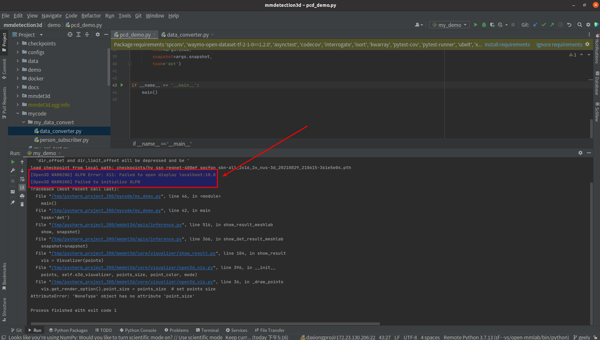
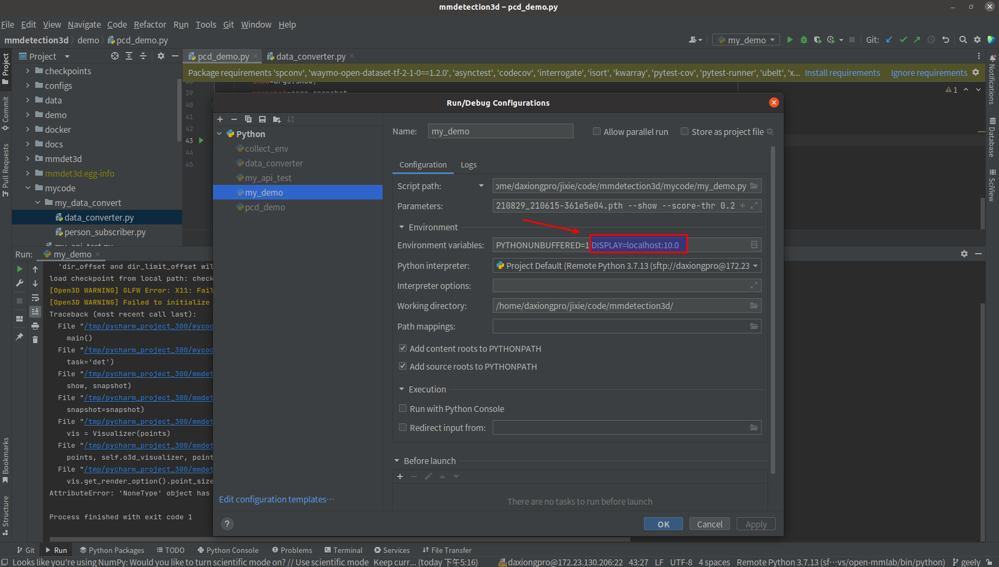
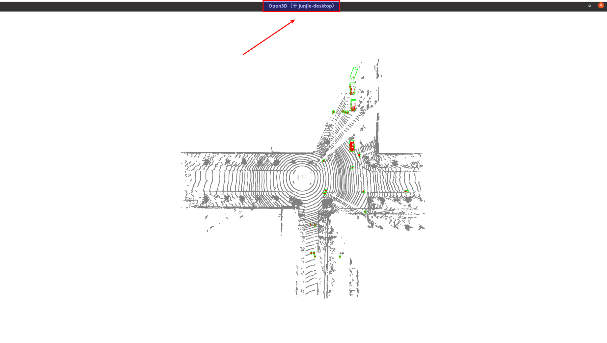

# Pycharm使用ssh远程python环境并在本地可视化open3d

### 需求：

使用pycharm专业版，ssh连接远程服务器的python环境，可视化需要用到open3d，但是远程python。现在想要使用远程python环境，但是在本地作open3d的可视化。

### 原理：

- 一般情况下ssh连接远程终端为：`ssh username@ip`。
- 突然发现加个-X，即：`ssh -X username@ip`，在命令行里面运行open3d的程序在本地也能可视化了。

### 操作步骤：

- ssh -X 连接到远程:`ssh -X username@ip` 。注意是大写的X！！！

- 在终端输入：`echo $DISPLAY`

显示`localhost:10.0`

- 在pycharm运行文件的configuration里面添加环境变量：`DISPLAY=localhost:10.0`

- 运行文件，显示

  

### 参考文献：

[pycharm SSH远程连接：cannot connect to X server](https://blog.csdn.net/m0_50181189/article/details/120958568)