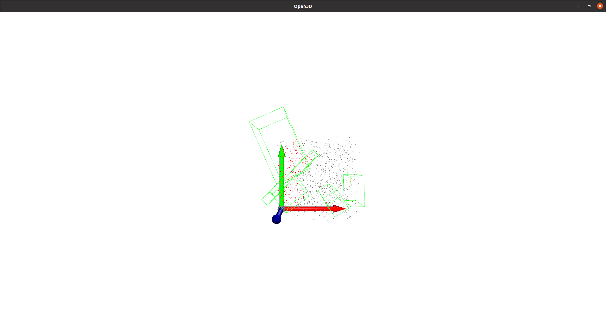
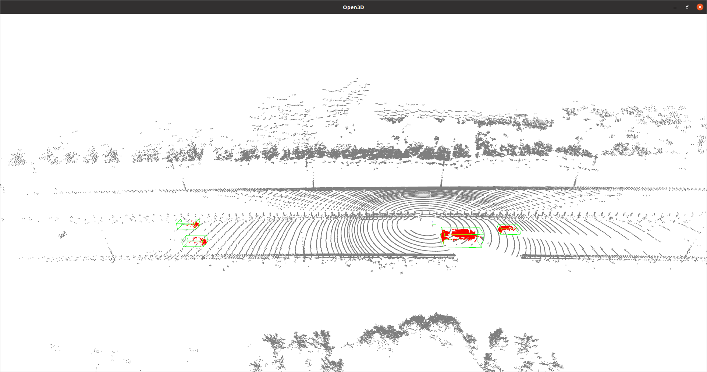

# open3d 显示 pointcloud 和 bbox

将点云数据(point cloud)及其真值(ground truth)使用 open3d 绘制。为了简便，可以使用 mmdetection3d api。

```python
import numpy as np
import torch
from mmengine.structures import InstanceData
from mmdet3d.structures import (DepthInstance3DBoxes, Det3DDataSample)
from mmdet3d.visualization import Det3DLocalVisualizer


def show_data(points=np.random.rand(1000, 3), bbox=torch.rand((5, 7))):
    """show point cloud data with openmmlab and open3d.

    :param points: point clouds, defaults to np.random.rand(1000, 3)
    :type points: numpy ndarray, optional
    :param bbox: bounding boxes, (xzywlhr), defaults to torch.rand((5, 7))
    :type bbox: numpy ndarray, optional
    """
    det3d_local_visualizer = Det3DLocalVisualizer()

    # points = np.random.rand(1000, 3)

    gt_instances_3d = InstanceData()
    gt_instances_3d.bboxes_3d = DepthInstance3DBoxes(bbox)
    # gt_instances_3d.labels_3d = torch.randint(0, 2, (5, ))

    gt_det3d_data_sample = Det3DDataSample()
    gt_det3d_data_sample.gt_instances_3d = gt_instances_3d

    data_input = dict(points=points)

    det3d_local_visualizer.add_datasample(
        '3D Scene',
        data_input,
        gt_det3d_data_sample,
        vis_task='lidar_det',
        show=True)

show_data()
```

使用时，将 points 和 bbox 换成自己的数据就行。

> points 表示点云数据，数据格式为np.ndarray，结构为(N, d)。N 表示点的数量。D 表示维度，D >=3。当 D>3 时，会自动处理成 (N, 3)；
>
> bbox 表示包围框，数据格式为 np.ndarray，结构为(N, 7)。N 表示包围框的数量。7 表示包围框的 7 个回归值，分别为：x,y,z,l,w,h,r。其中，xyz 表示包围框底边中心点的坐标，lwh 表示长宽高，r 表示包围框绕 z 轴的旋转角 yaw。

运行代码，可视化结果如下：



使用自己的数据集中的 points 和 bbox，可视化结果如下：



## 日期

2023/05/11：更新

* xyz 表示 bbox 底边中点
* 注释代码中的 label
* 增加数据集配图

2023/05/10：创作日期
