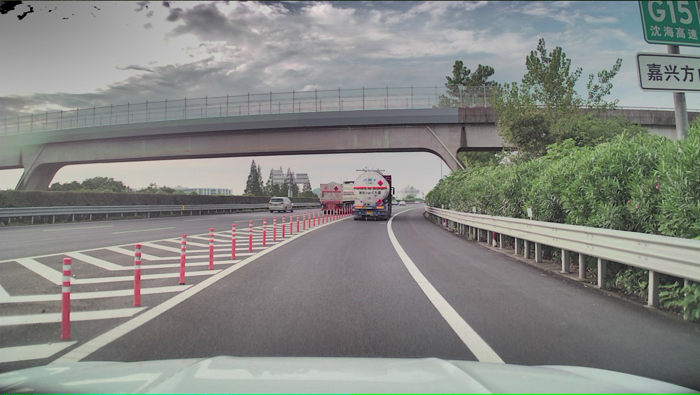
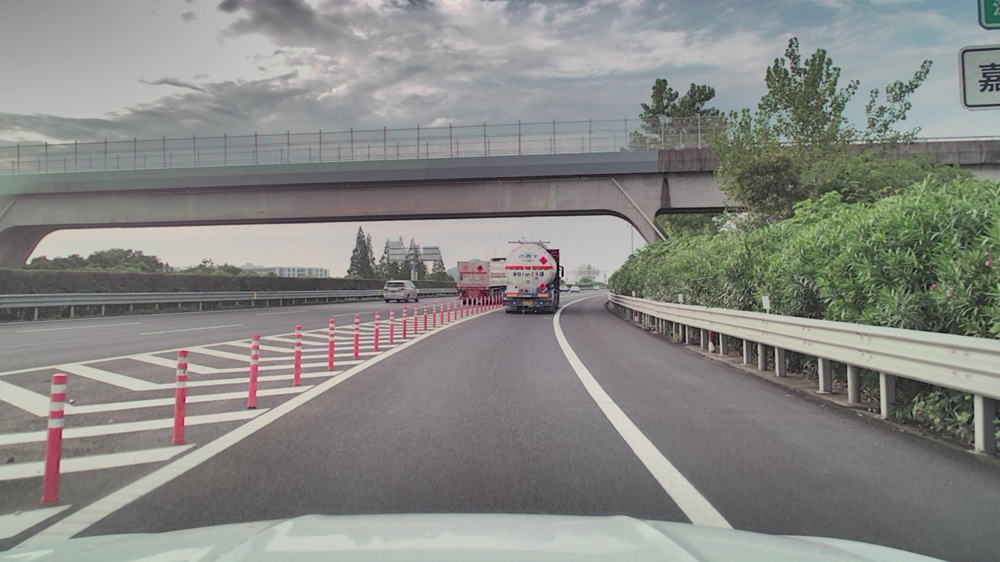

# Python 图像去畸变

鱼眼相机去畸变是图像处理的基本操作，本文介绍如何使用 OpenCV 对鱼眼相机拍摄的图像去畸变。

## 产生畸变的原因

简单理解：

* 每个摄像头都是一个透镜，光线经过透镜，会产生折线，所以是个镜头都会产生畸变。
* 每个镜头对光线产生的折线弯曲程度不一样，因此每个相机镜头的相机内参( K )和畸变系数( D )就会不同。
* 获取相机内参和畸变系数的方法就是标定。
* 常见的标定方法就是 12 格黑白棋盘法。通过拍一张黑白棋盘，去测量标定系数。

## 去畸变方法

关于去畸变的原理，比较繁琐，网上也有一大堆相关的文章。这里直接给出去畸变代码：

```python
import cv2
from PIL import Image
import numpy as np


cam_intrinsics = np.array([[3160.29999912, 0.0, 1904.13768376],
                           [0.0, 3169.88936807, 1130.12083743],
                           [0.0, 0.0, 1.0]], dtype=np.float32)

distortion = np.array([[-0.01897931],
                       [0.1906307],
                       [-0.61328069],
                       [0.55905323]], dtype=np.float32)


def distort(
    img_before='./img_before.jpg',
    img_after='./img_after.jpg',
    K=cam_intrinsics,
    D=distortion,
    resolution=(3840, 2160)
):
    """使用 OpenCV 图像去畸变

    :param img_before: 要处理的图像
    :param img_after: 处理后的图像完整路径
    :param K: 相机内参，np.array(3x3)
    :param D: 相机镜头畸变系数，np.array(4x1)
    :param resolution: 图像分辨率

    """

    img = Image.open(img_before)
    img = img.resize(resolution)
    img_bgr = cv2.cvtColor(np.asarray(img), cv2.COLOR_RGB2BGR)

    img_distort = cv2.fisheye.undistortImage(
        img_bgr,
        K,
        D,
        None,
        K,
        resolution
    )
    img_distort = cv2.cvtColor(img_distort, cv2.COLOR_BGR2RGB)
    img_distort = Image.fromarray(img_distort)
    img_distort = img_distort.resize((1920, 1080))
    img_distort.save(img_after)


def main():
    distort()


main()

```

> 其中，img_before 是去畸变之前的图像，img_after 是去畸变之后的图像。相机内参和畸变系数可以改成自己的相机镜头。

## 效果展示

去畸变之前：



去畸变之后：



## 日期

2023/08/29：文章撰写
