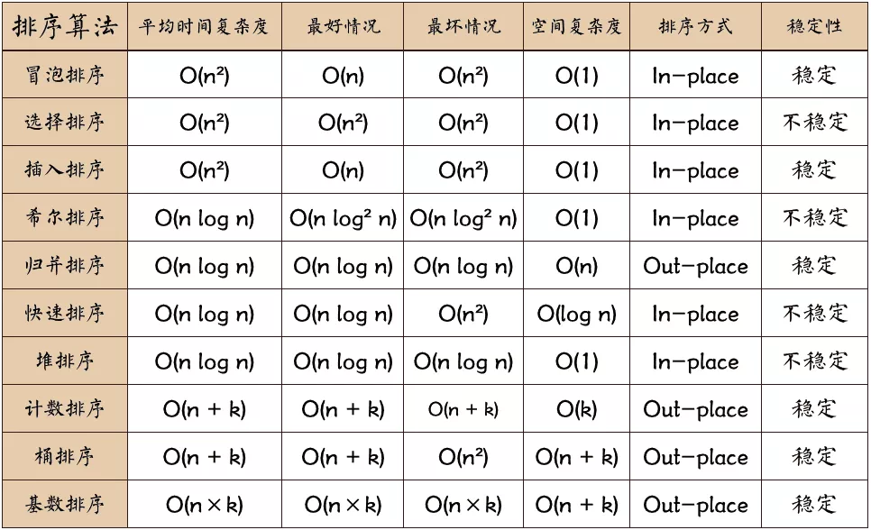

# 数据结构和算法

## 排序

Q：冒泡排序如何优化？

A：当某次冒泡操作已经不再进行数据交换时，说明数组已经达到有序，就不需要再继续执行后续的冒泡操作了。可以设置一个flag。

Q：归并排序？

A：先把数组从中间分成前后两部分，然后对前后两部分分别排序，再将排好序的两部分合并在一起 ，归并排序使用的是分治思想，分治算法一般用递归实现。

```cpp
merge_sort(A, n){
    merge_sort_c(A, 0, n-1)
}
merge_sort_c(A, p, r){
    // 递归终止条件
    if (p>=r) then return
    // 取 p、r 中间的位置为 q
    q = (p+r)/2
    // 分治递归
    merge_sort_c(A[p, q], p, q)
    merge_sort_c(A[q+1, r], q+1, r)
    // 将A[p...q]和A[q+1...r]合并为A[p...r]  
    merge(A[p...r], A[p...q], A[q+1...r])
}

```

Q：快速排序思想？

A：如果要排序数组中下标从 `p` 到 `r` 之间的一组数据，我们选择 `p` 到 `r` 之间的任意一个数据作为 `pivot`（ 分区点 ）。我们遍历 p 到 r 之间的数据，将小于 pivot 的放到左边，将大于 pivot 的放到右边，将 pivot 放到中间。经过这一步骤之后，数组 p 到 r 之间的数据就被分成了三个部分，前面 `p` 到 `q-1` 之间都是小于 `pivot` 的，中间是 `pivot`，后面的 `q+1` 到 `r` 之间是大于 `pivot` 的。

```python
def quicksort(array):
    if len(array) < 2: 
        # 基线条件：为空或只包含一个元素的数组是“有序”的
        return array
    else:
        # 递归条件
        pivot = array[0] 
        less = [x for x in array[1:] if x <= pivot]
        greater = [x for x in array[1:] if x > pivot]
        return quicksort(less) + [pivot] + quicksort(greater)
print(quicksort([4, 90, 0, 2, 17, 79, 12])) # [0, 2, 4, 12, 17, 79, 90]
```

上面的代码空间复杂度很大，真正的快排是原地排序，空间复杂度为O(1)，代码如下：

```python
# _*_ coding:utf-8 _*_

def quick_sort(L):
    return q_sort(L, 0, len(L)-1)

def q_sort(L, left, right):
    if left < right:
        pivot = Partition(L, left, right)
        q_sort(L, left, pivot-1)
        q_sort(L, pivot+1, right)

    return L

def Partition(L, left, right):
    pivotkey = L[left]

    while left < right:
        while left < right and L[right] >= pivotkey:
            right -= 1
        L[left] = L[right]
        while left < right and L[left] <= pivotkey:
            left += 1
        L[right] = L[left]  # 遇到比基准大的数, 则覆盖在之前尾部指针的位置
    L[left] = pivotkey
    return left


if __name__ == "__main__":
    L = [5, 9, 1, 1, 11, 6, 7, 2, 4]
    print(quick_sort(L))
```

Q：排序算法比较：

A：


