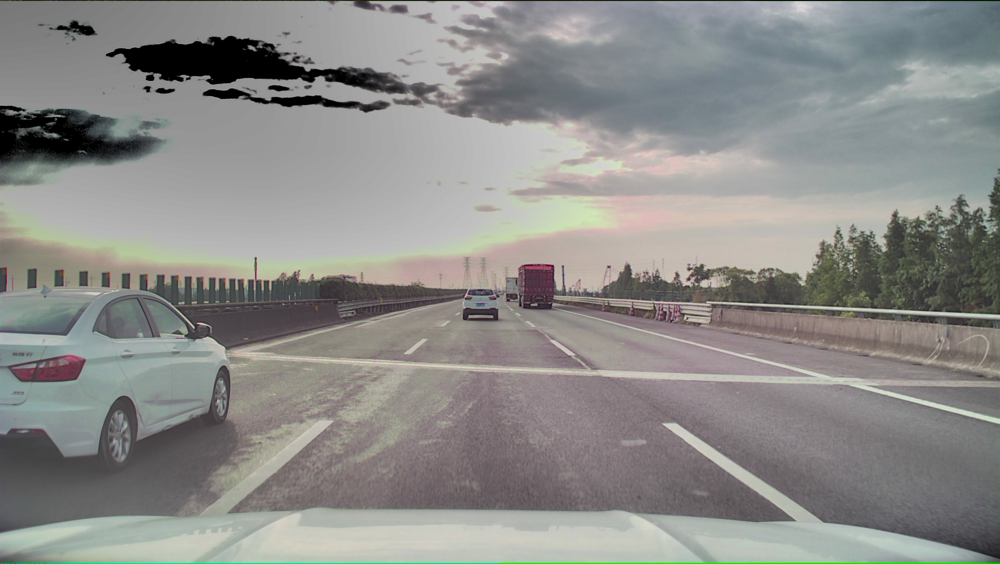
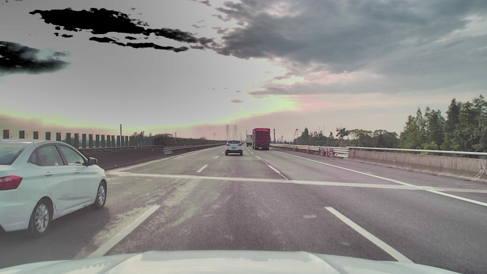
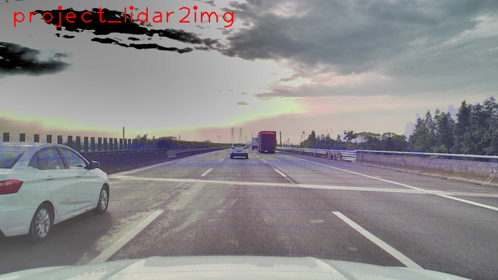

# 多传感器同步——点云投影到图像

自动驾驶车辆上有多种传感器。这就涉及到多传感器同步问题。其中包括多相机之间的同步，以及激光雷达和相机之间的同步。如果同一帧的数据上， A 传感器和 B 传感器采集到的数据不同步，则无法将多传感器采集到的数据用于模型检测，哪怕检测出来的效果也很不好。因此，获得的数据需要查看是否同步。同步的方法是将点云投影到图像上，看图像上的点与 object 是否基本重合。本文介绍如何将点云投影到图像。

## 点云投影到图像

点云投影到图像大致分为以下步骤：

* 图像去畸变
* 坐标系转换
* 绘制图像

## 图像去畸变

参考前文：[Python 图像去畸变](../img_distort/img_distort.md)

## 坐标系转换

通过相机内外参，将点云坐标系->相机坐标系->像素坐标系

原理参考 CSDN 博客：[机器视觉模型——投影矩阵](https://blog.csdn.net/hangl_ciom/article/details/106082794)

结论如下：像素坐标系与世界坐标系的投影矩阵

$$
\begin{bmatrix}{}
u \\ v \\ 1
\end{bmatrix}
=
\frac{1}{Z_C}
M_1
M_2
\begin{bmatrix}{}
X_W \\ Y_W \\ Z_W \\1
\end{bmatrix}
$$

其中：
$Z_C$ ——空间点在相机坐标系中的Z坐标

$M_1$——内参矩阵，4×4矩阵( 此处做了修改，增添最后一行 0001 )，

$$
M_1=
\begin{bmatrix}{}
-f/dx && 0 && u_0 && 0 \\
0 && -f/dy && v_0 && 0 \\
0 && 0 && 1 && 0 \\
0 && 0 && 0 && 1
\end{bmatrix}
$$

$M_2$——外参矩阵，4×4矩阵，

$$
M_2=
\begin{bmatrix}{}
r_{11} && r_{12} && r_{13} && t_x \\
r_{21} && r_{22} && r_{23} && t_y \\
r_{31} && r_{32} && r_{33} && t_z \\
0 && 0 && 0 && 1 \\
\end{bmatrix}
$$

具体代码如下：

```python
def project(points, image, M1, M2):
    """
    points: Nx3
    image: opencv img, 表示要投影的图像
    M1: 内参矩阵 K, 4*4
    M2: 外参矩阵， 4*4

    return: points 在像素坐标系下的坐标 N*4, 实际只用 N*2

    """
    resolution = image.shape

    coords = points[:, 0:3]
    ones = np.ones(len(coords)).reshape(-1, 1)
    coords = np.concatenate([coords, ones], axis=1)
    transform = copy.deepcopy(M1 @ M2).reshape(4, 4)
    coords = coords @ transform.T
    coords = coords[np.where(coords[:, 2] > 0)]

    coords[:, 2] = np.clip(coords[:, 2], a_min=1e-5, a_max=1e5)
    coords[:, 0] /= coords[:, 2]
    coords[:, 1] /= coords[:, 2]

    coords = coords[np.where(coords[:, 0] > 0)]
    coords = coords[np.where(coords[:, 0] < resolution[1])]
    coords = coords[np.where(coords[:, 1] > 0)]
    coords = coords[np.where(coords[:, 1] < resolution[0])]

    return coords
```

## 绘制图像

使用 OpenCV 将转换后的点在去畸变的图像上描绘并显示。

```python
def show_with_opencv(image, coords=None):
    """
    image: opencv image
    coords: 像素坐标系下的点, N*4
    """
    canvas = image.copy()
    cv2.putText(canvas,
                text='project_lidar2img',
                org=(90, 180),
                fontFace=cv2.FONT_HERSHEY_PLAIN,
                fontScale=12.0,
                thickness=10,
                color=(0, 0, 255))
    canvas = cv2.cvtColor(canvas, cv2.COLOR_RGB2BGR)
    # 画点
    if coords is not None:
        for index in range(coords.shape[0]):
            p = (int(coords[index, 0]), int(coords[index, 1]))
            cv2.circle(canvas, p, 2, color=[0, 0, 255], thickness=1)
    canvas = canvas.astype(np.uint8)
    canvas = cv2.cvtColor(canvas, cv2.COLOR_BGR2RGB)

    print(canvas.shape)
    canvas = cv2.resize(canvas, (1920, 1080))
    cv2.namedWindow("image")  # 创建一个image的窗口
    cv2.imshow("image", canvas)  # 显示图像
    cv2.waitKey(0)  # 默认为0，无限等待
```

## 完整代码

```python
import copy
from typing import List, Optional, Tuple
import cv2
import numpy as np
from scipy.spatial.transform import Rotation as R
from PIL import Image


def read_pcd(pcd_file):
    with open(pcd_file, 'rb') as f:
        data = f.read()
        data0 = data[data.find(b"DATA binary") + 12:]
        points = np.frombuffer(data0, dtype=np.float32).reshape(-1, 4)
        o = np.zeros((len(points), 1))
        points = np.hstack((points, o))
        points = points.astype(np.float32)
    return points


def project(points, image, M1, M2):
    """
    points: Nx3
    image: opencv img, 表示要投影的图像
    M1: 内参矩阵 K, 4*4
    M2: 外参矩阵， 4*4

    return: points 在像素坐标系下的坐标 N*4, 实际只用 N*2

    """
    resolution = image.shape

    coords = points[:, 0:3]
    ones = np.ones(len(coords)).reshape(-1, 1)
    coords = np.concatenate([coords, ones], axis=1)
    transform = copy.deepcopy(M1 @ M2).reshape(4, 4)
    coords = coords @ transform.T
    coords = coords[np.where(coords[:, 2] > 0)]

    coords[:, 2] = np.clip(coords[:, 2], a_min=1e-5, a_max=1e5)
    coords[:, 0] /= coords[:, 2]
    coords[:, 1] /= coords[:, 2]

    coords = coords[np.where(coords[:, 0] > 0)]
    coords = coords[np.where(coords[:, 0] < resolution[1])]
    coords = coords[np.where(coords[:, 1] > 0)]
    coords = coords[np.where(coords[:, 1] < resolution[0])]

    return coords


def show_with_opencv(image, coords=None):
    """
    image: opencv image
    coords: 像素坐标系下的点, N*4
    """
    canvas = image.copy()
    cv2.putText(canvas,
                text='project_lidar2img',
                org=(90, 180),
                fontFace=cv2.FONT_HERSHEY_PLAIN,
                fontScale=12.0,
                thickness=10,
                color=(0, 0, 255))
    canvas = cv2.cvtColor(canvas, cv2.COLOR_RGB2BGR)
    # 画点
    if coords is not None:
        for index in range(coords.shape[0]):
            p = (int(coords[index, 0]), int(coords[index, 1]))
            cv2.circle(canvas, p, 2, color=[0, 0, 255], thickness=1)
    canvas = canvas.astype(np.uint8)
    canvas = cv2.cvtColor(canvas, cv2.COLOR_BGR2RGB)

    print(canvas.shape)
    canvas = cv2.resize(canvas, (1920, 1080))
    cv2.namedWindow("image")  # 创建一个image的窗口
    cv2.imshow("image", canvas)  # 显示图像
    cv2.waitKey(0)  # 默认为0，无限等待


def main():
    points = read_pcd('2023_08/point2img/src/1690103183503481960.pcd')
    img = cv2.imread('2023_08/point2img/src/1690103183500000030_distort.jpg')
    M1 = np.array([[3.1603000e+03, 0.0000000e+00, 1.9041377e+03, 0.0000000e+00],
                   [0.0000000e+00, 3.1698894e+03, 1.1301208e+03, 0.0000000e+00],
                   [0.0000000e+00, 0.0000000e+00, 1.0000000e+00, 0.0000000e+00],
                   [0.0000000e+00, 0.0000000e+00, 0.0000000e+00, 1.0000000e+00]],
                  dtype=np.float32)
    M2 = np.array([[-0.00515716, -0.99998194, -0.0030866, -0.023396],
                   [-0.00895637,  0.00313271, -0.99995498,  1.471208],
                   [0.99994659, -0.00512929, -0.00897237, -1.933807],
                   [0.,  0.,  0.,  1.]], dtype=np.float32)

    coords = project(points, img, M1, M2)
    show_with_opencv(img, coords=coords)


main()

```

## 效果展示

原始图像：



去畸变后的图像：



点云投影到图像上：



## 日期

2023/08/31：文章撰写日期
