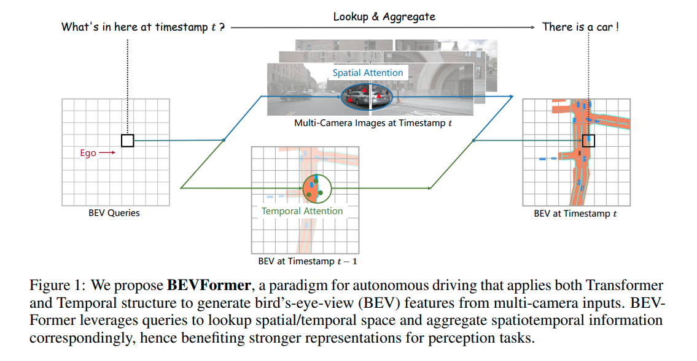
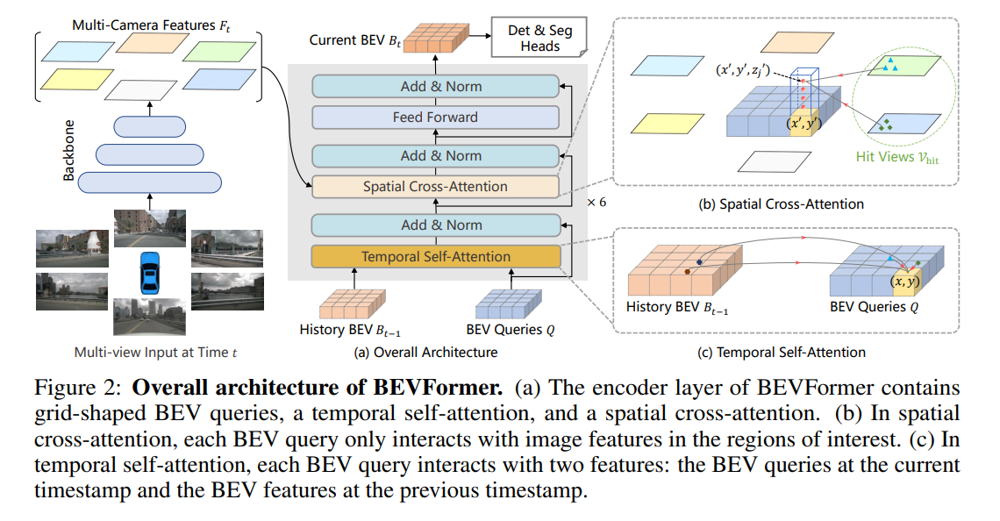

## 论文解读——BEVFormer

BEVFormer 是另一篇基于 DETR3D 的论文。纯视觉 BEV 3D 目标检测的难点在于，如何将 3D 空间与 2D 空间对应。因此想到使用注意力机制，让3D 空间自适应查找 2D 空间。Transormer 天然使用自注意力机制。但是使用 Transformer 的弊端在于查询的过程中，token 数量太大，让 3D 空间的每个点去查询 2D 空间的每个点，这个复杂度是平方的数量级 $O(n^2)$。因此，作者对Q 和 K 进行稀疏查询。于此同时，作者在查询的时候，只考虑与当前 3D 空间对应的 2D 图像，进一步减少计算量。另一个创新点是使用时序注意力。由于车辆在行驶的过程中，物体的位置变化不大，下一帧的车辆很可能在上一帧的附近。因此，上一帧的 BEV 特征，在下一帧具有非常重要的参考意义。我们知道不同帧的车偏移量不同。对此，作者采用 Deformable DETR 的方式，即可形变注意力，使得 offset 可学习。

### 创新点

* 采用了稀疏的、可形变的 attention
* 利用了时序 BEV 特征

### 整体流程

### 详细过程

> 最左边为图像特征提取，得到图像特征。最重要的是中间部分，(a) 图中，当前帧的 BEV Query 与 上一帧的 BEV feature map 作 self attention。然后再与图像特征作 cross attention。最终得到当前帧的 BEV feature map。(b)图说明了在当前帧的 Query 中，垂直方向设置 4 个锚点，用这些锚点与 2D 图像作查询匹配。这里说明一下，查询的过程中，使用了 Deformable 方法，去图像的不同区域获取特征，这在图中没有表现出来。(c) 图表示从历史帧的 feature map 得到当前帧的 Query，也使用了 Deformable 方法。

### 参考资料

* [知乎——bevformer 论文笔记](https://zhuanlan.zhihu.com/p/532490271)
* [视频讲解——原作者](https://apposcmf8kb5033.pc.xiaoe-tech.com/live_pc/l_62a2b971e4b01c509abc27f2)
* [b 站视频讲解——自动驾驶之心](https://www.bilibili.com/video/BV1Mm4y1H7Hg/?spm_id_from=333.337.search-card.all.click&vd_source=da7944bcc998e29818ec76ea9c6f1f47)
