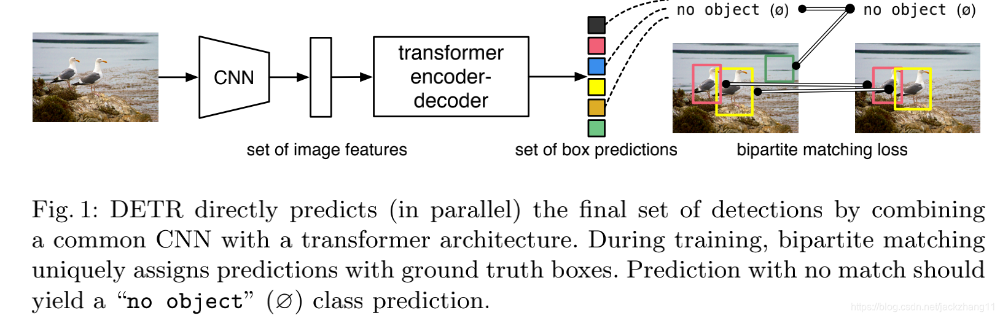
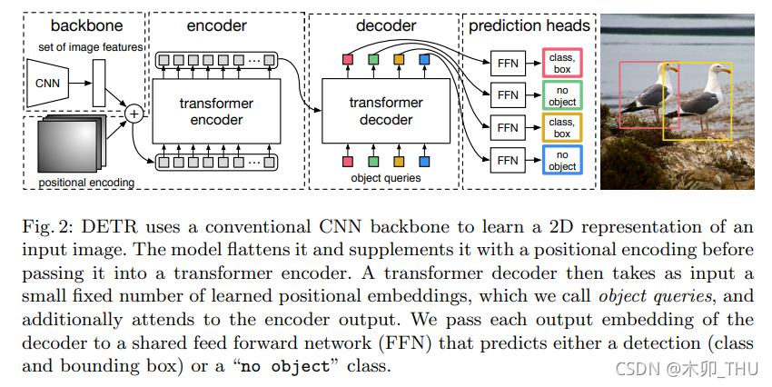
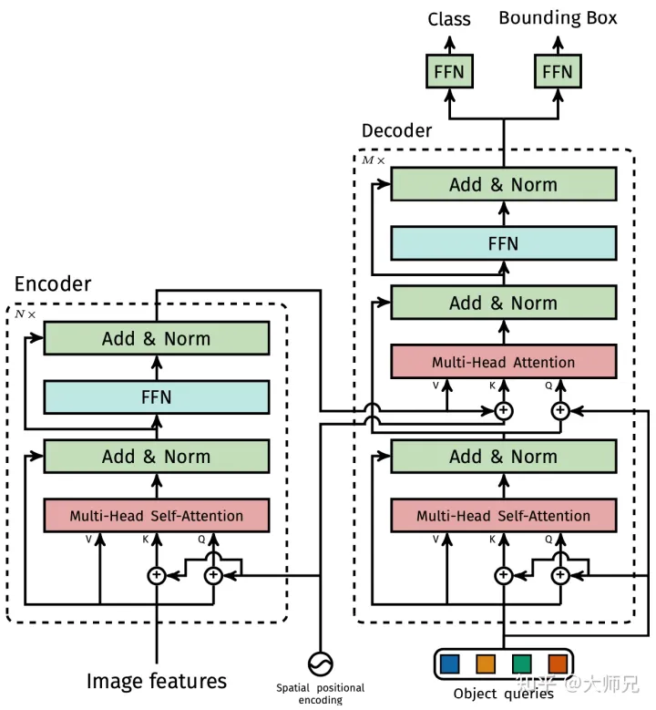
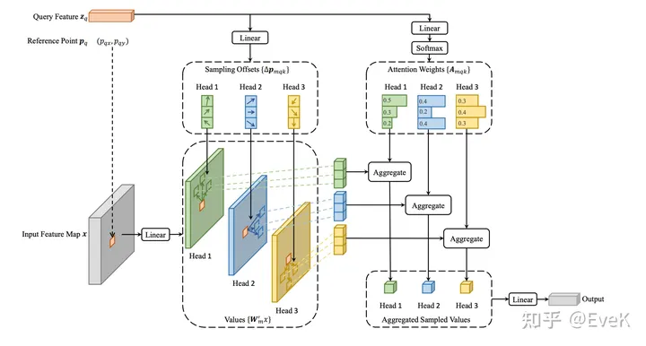

# 一文看懂 CMT: Cross Modal Transformer: Towards Fast and Robust 3D Object Detection

CMT 基于 PERT，PETR 基于 DETR3D，DETR3D 基于 Deformable DETR ，Deformable DETR 基于 DETR，即，CMT -> PETR -> DETR3D -> Deformable DETR -> DETR。一点点介绍。

## DETR

DETR 全称 **DE**tection **TR**ansformer，是将 Transformer 引入目标检测的开山之作。这是一个全新的目标检测架构。传统的目标检测方法，例如 R-CNN 系列、YOLO 系列，都是使用间接的方法来目标检测。间接的意思为：先给出 proposals (R-CNN) 或者 anchor (YOLO)，然后进行分类、回归，最后进行 NMS 后处理。但是生成 proposals、anchor 以及 NMS 后处理模块很慢，因此，此类目标检测架构性能受限。

### 创新点

* 设计了一个全新的目标检测架构——Transformer
* 取消了 NMS、anchor
* loss 使用二分图匹配——匈牙利匹配算法

### 整体结构示意

> 输入图片，经过 CNN 特征提取，经过 Transformer 得到一系列的预测框，在上图中就是一系列的彩色方格(set of predictions)。预测框的个数是个超参数，文章中设置为 100，即每张图恒定会输出 100 个框，但可能其中只有 2 个框是有 object 的，其他框都为 None。因此，计算 loss 的时候使用二分图匹配，将预测框与 gt 匹配。匹配就是给出一个代价矩阵，用 scipy 库中 linear_sum_assignment(cost matrix) 方法，就可以直接计算，详见 [b 站视频讲解——李沐](https://www.bilibili.com/video/BV1GB4y1X72R/?spm_id_from=333.337.search-card.all.click&vd_source=da7944bcc998e29818ec76ea9c6f1f47)。

### 详细过程

> 输入图片，通过CNN 特征提取得到图像 feature map。然后加上图像位置编码，得到图像的一个个 patch，这一个个 patch 就是 transformer encoder 的输入 token。然后这些 token 经过 transformer encoder。这里 encoder 部分跟 VIT 是一样的。
>
> decoder 输入是一些 query，这些 query 要经过初始化，初始化的值为“0+positional encoder"。要预测多少个 object，就设置多少个 query。这些 query 从 encoder 输出的 token 的 key 去匹配，进行 transformer decoder 操作。最后经过全连接网络得到预测结果。

### 结构的通俗理解

#### encoder

图片经过 CNN 得到的 feature map，可以将图片分割成一小块一小块，也就是一个个 patch。由于加上了 positional encoding，就可以将这些 patch 拉直成输入 transformer encoder 的 token。这些 token 经过 transformer encoder 就得到图片全局特征。

#### decoder

前文说到，输入的 query 就是 positional encoder，其表示每一个 query 负责查询图片的某块区域。每一个 query 去全局特征 token 的 key 去匹配，查询有没有这个 query 想要的信息，如有，就将注意力关注这个 token。也可以将这些 query 理解为 anchor，只不过这些 anchor 都是可学习的向量，而不是像 anchor 一样定死的。

### 参考资料

* [b 站视频讲解——唐宇迪](https://www.bilibili.com/video/BV1R14y1N77a/?p=2&spm_id_from=pageDriver&vd_source=da7944bcc998e29818ec76ea9c6f1f47)
* [b 站视频讲解——李沐](https://www.bilibili.com/video/BV1GB4y1X72R/?spm_id_from=333.337.search-card.all.click&vd_source=da7944bcc998e29818ec76ea9c6f1f47)

## Deformable DETR

Deformable DETR 提出了可变形注意模块 ，其仅关注特征图上一小部分关键的采样点。并且该模块可以自然地扩展到聚合多尺度特征，而无需FPN的帮助。

DETR 缺点：

* DETR 收敛慢
* 能够处理的特征分辨率有限，小目标效果差

原因：

* Transformer在初始化时，分配给所有特征像素的注意力权重几乎是均等的 ，这就造成了模型需要长时间去学习关注真正有意义的位置，这些位置应该是稀疏的；
* Transformer在计算注意力权重时，伴随着高计算量与空间复杂度。 特别是在编码器部分，与特征像素点的数量成平方级关系，因此难以处理高分辨率的特征（这点也是DETR检测小目标效果差的原因）

具体做法：

* 针对收敛慢的问题：学习稀疏的空间位置，用可变形卷积的思想，即可变型注意力
* 针对小目标效果差的问题：多尺度采样

### 整体结构示意

### 详细过程

Q：如何使用多尺度？

A：resnet 下采样过程中产生不同尺度的 feature map，通过 1x1 conv 将其变为通道数，然后将不同尺度的像素都作 faltten 拉直，并拼接，得到 token。

Q：如何可形变操作？

A：每个 token 的 query 学习 n 个偏移量，得到 n 个要与之计算的 token，并与这 n 个 token 的 key 作计算。

### 参考资料

* [b 站视频讲解——Deformable Detr 论文思想讲解（一听就会）](https://www.bilibili.com/video/BV12T411R7uk/?spm_id_from=333.337.search-card.all.click&vd_source=da7944bcc998e29818ec76ea9c6f1f47)
* [b 站视频讲解——Deformable DETR｜ Deformable Attention ｜ MSDeformAttention ｜流程讲解](https://www.bilibili.com/video/BV1Uj411z7QU/?p=13&spm_id_from=pageDriver)
* [知乎——Deformable DETR: 基于稀疏空间采样的注意力机制，让DCN与Transformer一起玩！](https://zhuanlan.zhihu.com/p/372116181)
* [CSDN——Deformable DETR要点解读](https://blog.csdn.net/xijuezhu8128/article/details/118693939)

## DERT3D

BEV 的好处：

* 统一完整场景
* 多帧时序、多传感器融合
* 利于目标跟踪，预测等下游任务

## PERT

### 参考资料

[b 站视频讲解——自动驾驶之心](https://www.bilibili.com/video/BV1ru4y1v7PY/?spm_id_from=333.337.search-card.all.click)

## CMT

## BEVFormer

知乎 [bevformer 论文笔记](https://zhuanlan.zhihu.com/p/532490271)

bevformer 作者对[论文解读](https://apposcmf8kb5033.pc.xiaoe-tech.com/live_pc/l_62a2b971e4b01c509abc27f2)
