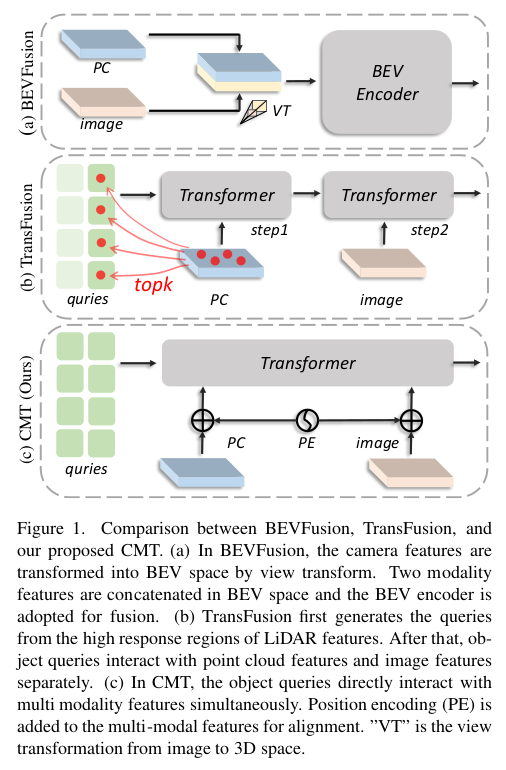
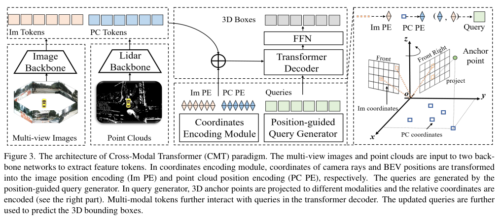

## 论文解读——CMT：Cross Modal Transformer

CMT 是旷视在 ICCV2023 的一篇论文，其基于 PERT，并加入了激光雷达数据，利用 Transformer 很好地融合了两种模态的数据。新手小白建议先看 DETR 系列。论文的继承关系为：CMT -> PETR -> DETR3D -> Deformable DETR -> DETR。可以看我之前对这些论文的解读。

CMT的优点如下：

1. 隐式地将3D位置编码到多模态特征中，避免了显式跨视图特征对齐时存在的偏差（bias）。
2. 模型仅包含基础操作，无需2D到3D的视图变换，能达到SotA性能。
3. 鲁棒性强。在没有激光雷达的情况下，模型的性能能达到与基于视觉的方法相当的水平。

> 摘自——参考资料2。

下图比较了几种多模态 3D 目标检测的对比。

> BEVFusion 是利用 lss 那一套，将 image feature 投影到 3D 坐标空间中；Transfusion 和 CMT 是利用 Transformer，得到 image 和 point feature 的 3D 编码。

### 整体流程

> 上图展示了 CMT 的整体流程。结构很简单，在 img 和 points 的 token 分别加上对应的 positional encoder(两个 PE)，再用位置 Query 去查询。

### 详细过程

详细过程为论文的第三节。分为 image 坐标编码、points 坐标编码、Query 位置编码、Decoder 和 Loss。

#### image 坐标编码

这部分与 PETR 类似。在[论文解读——PERT](../PETR_paper/PETR_paper.md) 已有介绍，这里再详细讲解一下公式。图像首先经过 backbone，得到特征图。这里的 backbone 可以是 ResNet，也可以是 VoVNet。本文特征图的大小为 (BN, C, H, W) = (batch_size * 6, 256, 40, 100)。在 3D 位置编码阶段，feature map 上的每个像素都有 d 个深度点，这些点可以表示为：

$$
{p_k (u, v) = (u ∗ d_k , v ∗ d_k , d_k , 1)^T , k = 1, 2, ..., d}
$$

随后，这些点再通过相机内外参映射到 3D 空间中：

$$
p^{im}_k (u, v) = T_{c_i}^l K_i^{-1} p_k (u, v)
$$

$T_{c_i}^l$ 是外参矩阵，其表示从第 i 个 camera 坐标系到 lidar 坐标系的转换。$K_i^{-1}$ 是内参矩阵，表示第 i 个相机的内参。

最后，图像的位置编码可以表示成：

$$
Γ_{im} (u, v) = ψ_{im} ({p^{im}_k (u, v),k = 1, 2, ..., d})
$$

其中，$ψ_{im}$ 是 MLP。

#### points 坐标编码

点云坐标编码就比较简单了。点云数据首先经过 backbone 网络，例如 VoxelNet 或者 PointPillar，得到 BEV 视角下的 2D featrure map。对于这个 feature map 上的每个点 (u, v)，在其高度位置上采样 k 个点(对比图像模块是深度上采样 k 个点)。采样的 k 个点可以表示为：

$$
p_k (u, v) = (u, v, h_k , 1)^T
$$

其位置编码为：

$$
p^{pc}_k (u, v) =(u ∗ u_d , v ∗ v_d , h_k , 1)
$$

其中，u_d，v_d 表示 BEV feature map 上每个 grid 的大小。

最后，点云的位置编码可以表示成：

$$
Γ_{pc} (u, v) = ψ_{pc} ({p^{pc}_k (u, v),k = 1, 2, ..., h})
$$

其中，$ψ_{pc}$ 是 MLP。

#### Query 位置编码

与 DETR 一样，首先设置 n 个 query。这 n 个 query 可以看作是 n 个 anchor 点。其可以表示为：

$$
A=\left\{a_{i}=\right.\left.\left(a_{x, i}, a_{y, i}, a_{z, i}\right), i=1,2, \ldots, n\right\}
$$

其 xyz 的取值范围为 [0, 1]。这些点为均匀采样。

然后将这些点映射到 3D 坐标系的真实坐标，公式如下：

$$
\left\{\begin{array}{l}a_{x, i}=a_{x, i} *\left(x_{\max }-x_{\min }\right)+x_{\min } \\ a_{y, i}=a_{y, i} *\left(y_{\max }-y_{\min }\right)+y_{\min } \\ a_{z, i}=a_{z, i} *\left(z_{\max }-z_{\min }\right)+z_{\min }\end{array}\right.
$$

其中的 min max 表示 3D 坐标系的感知范围。

然后将这些随机点投影到图像或者点云的坐标系中，分别使用 image 坐标编码和 points 坐标编码，将这些点编码。最后，位置编码可以表示为两种模态的坐标编码相加：

$$
Γ_q = ψ_{pc} (A_{pc}) + ψ_{im} (A_{im})
$$

$Γ_q$ 会与查询内容嵌入相加，生成初始的位置指导的查询 $Q_0$ 。(疑问：查询内容嵌入是啥？)

### 参考资料

1. [知乎——【论文阅读1】Cross Modal Transformer: Towards Fast and Robust 3D Object Detection](https://zhuanlan.zhihu.com/p/647627947)
2. [CSDN——【论文笔记】Cross Modal Transformer: Towards Fast and Robust 3D Object Detection](https://blog.csdn.net/weixin_45657478/article/details/132129501)

## 日期

2023/09/13：文章撰写日期
