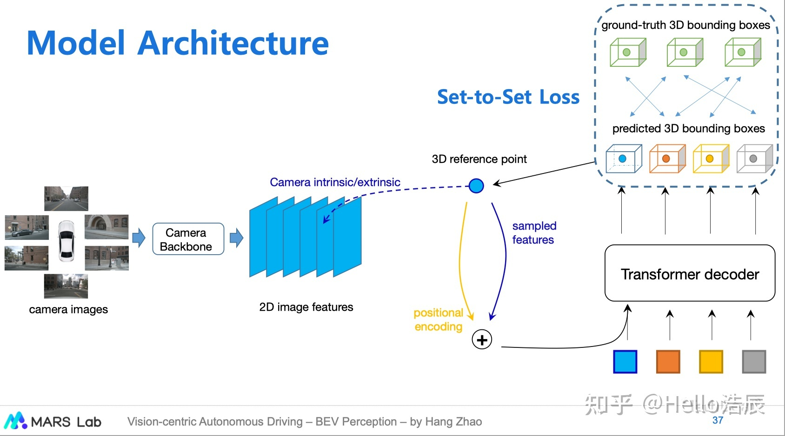
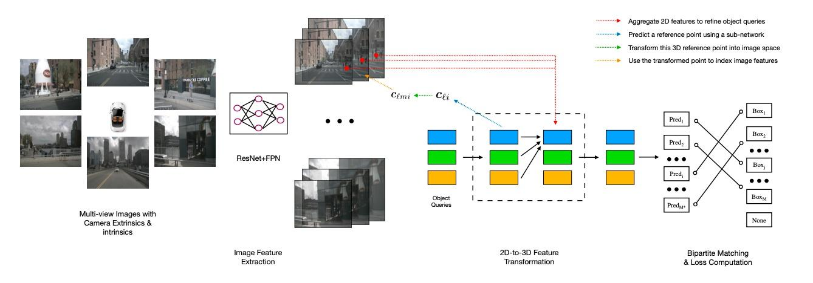

## 论文解读——DERT3D

DETR3D 是将 Transformer 引入 BEV 3D 目标检测的开山之作。其灵感很大程度上来自于 deformable DETR。

BEV 的好处：

* 统一完整场景
* 多帧时序、多传感器融合
* 利于目标跟踪，预测等下游任务出

### 创新点

* 将 deformable DETR 应用到 3D 目标检测
* 将 3D 空间的点映射到图像，并从图像上拿 3D 特征

### 整体流程

> 首先初始化一堆 query，这些 query 去预测物体在 3D 空间中的 anchor 的中心点，这些中心点称为"参考点"。同时图像采用 resnet+fpn 得到多尺度图像融合特征。然后用这些参考点利用相机参数去反向投影到图片的 feature map 上，得到图片的 feature。这个 feature 与 positional encoder 相加得到 token。然后用初始化的 query 与这些 token 作 cross attention。

### 详细过程

> 随机初始化一些查询向量。可以看到在图像特征提取的过程中，使用多尺度。最终的 token 从不同尺度的图像上获取。
