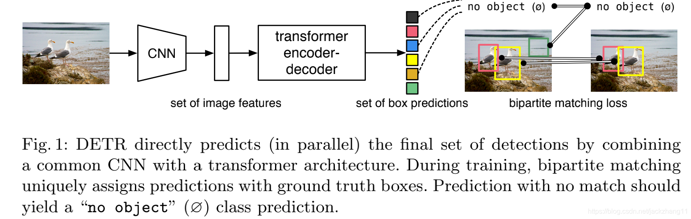
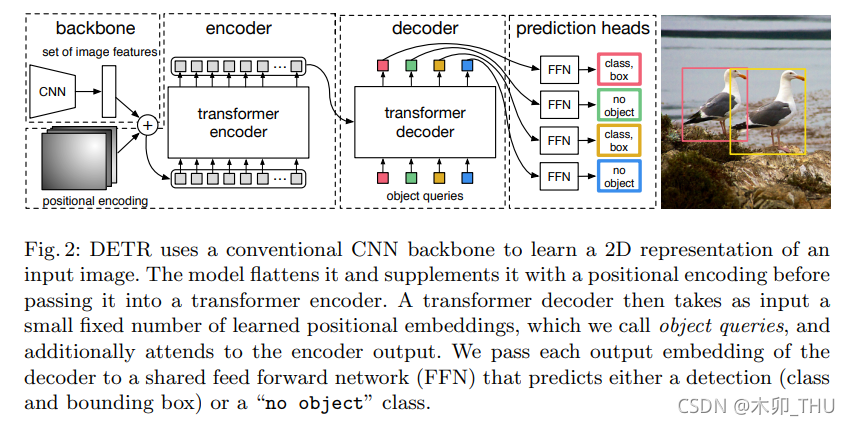

## 论文解读——DETR

DETR 全称 **DE**tection **TR**ansformer，是将 Transformer 引入目标检测的开山之作。这是一个全新的目标检测架构。传统的目标检测方法，例如 R-CNN 系列、YOLO 系列，都是使用间接的方法来目标检测。间接的意思为：先给出 proposals (R-CNN) 或者 anchor (YOLO)，然后进行分类、回归，最后进行 NMS 后处理。但是生成 proposals、anchor 以及 NMS 后处理模块很慢，因此，此类目标检测架构性能受限。

### 创新点

* 设计了一个全新的目标检测架构——Transformer
* 取消了 NMS、anchor
* loss 使用二分图匹配——匈牙利匹配算法

### 整体流程

> 输入图片，经过 CNN 特征提取，经过 Transformer 得到一系列的预测框，在上图中就是一系列的彩色方格(set of predictions)。预测框的个数是个超参数，文章中设置为 100，即每张图恒定会输出 100 个框，但可能其中只有 2 个框是有 object 的，其他框都为 None。因此，计算 loss 的时候使用二分图匹配，将预测框与 gt 匹配。匹配就是给出一个代价矩阵，用 scipy 库中 linear_sum_assignment(cost matrix) 方法，就可以直接计算，详见 [b 站视频讲解——李沐](https://www.bilibili.com/video/BV1GB4y1X72R/?spm_id_from=333.337.search-card.all.click&vd_source=da7944bcc998e29818ec76ea9c6f1f47)。

### 详细过程

> 输入图片，通过CNN 特征提取得到图像 feature map。然后加上图像位置编码，得到图像的一个个 patch，这一个个 patch 就是 transformer encoder 的输入 token。然后这些 token 经过 transformer encoder。这里 encoder 部分跟 VIT 是一样的。
>
> decoder 输入是一些 query，这些 query 要经过初始化，初始化的值为“0+positional encoder"。要预测多少个 object，就设置多少个 query。这些 query 从 encoder 输出的 token 的 key 去匹配，进行 transformer decoder 操作。最后经过全连接网络得到预测结果。

### 结构的通俗理解

#### encoder

encoder 部分称为 "self-attention"。图片经过 CNN 得到的 feature map，可以将图片分割成一小块一小块，也就是一个个 patch。由于加上了 positional encoding，就可以将这些 patch 拉直成输入 transformer encoder 的 token。这些 token 经过 transformer encoder 就得到图片全局特征。

#### decoder

decoder 部分成为 "cross-attention"。前文说到，输入的 query 就是 positional encoder，其表示每一个 query 负责查询图片的某块区域。每一个 query 去全局特征 token 的 key 去匹配，查询有没有这个 query 想要的信息，如有，就将注意力关注这个 token，并聚合(收集) 这个 token 的特征。也可以将这些 query 理解为 anchor，只不过这些 anchor 都是可学习的向量，而不是像 anchor 一样定死的。

### 参考资料

* [b 站视频讲解——唐宇迪](https://www.bilibili.com/video/BV1R14y1N77a/?p=2&spm_id_from=pageDriver&vd_source=da7944bcc998e29818ec76ea9c6f1f47)
* [b 站视频讲解——李沐](https://www.bilibili.com/video/BV1GB4y1X72R/?spm_id_from=333.337.search-card.all.click&vd_source=da7944bcc998e29818ec76ea9c6f1f47)

## 日期

* 2024/06/20：修改 decoder 部分解读
* 2023/09/07：文章撰写日期
