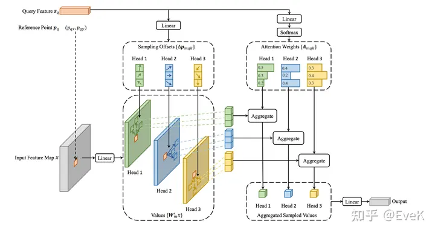

## 论文解读——Deformable DETR

Deformable DETR 提出了可变形注意模块 ，其仅关注特征图上一小部分关键的采样点。并且该模块可以自然地扩展到聚合多尺度特征，而无需FPN的帮助。

DETR 缺点：

* DETR 收敛慢
* 能够处理的特征分辨率有限，小目标效果差

原因：

* Transformer在初始化时，分配给所有特征像素的注意力权重几乎是均等的 ，这就造成了模型需要长时间去学习关注真正有意义的位置，这些位置应该是稀疏的；
* Transformer在计算注意力权重时，伴随着高计算量与空间复杂度。 特别是在编码器部分，与特征像素点的数量成平方级关系，因此难以处理高分辨率的特征（这点也是DETR检测小目标效果差的原因）

具体做法：

* 针对收敛慢的问题：学习稀疏的空间位置，用可变形卷积的思想，即可变型注意力
* 针对小目标效果差的问题：多尺度采样

### 整体流程

### 详细过程

Q：如何使用多尺度？

A：resnet 下采样过程中产生不同尺度的 feature map，通过 1x1 conv 将其变为通道数，然后将不同尺度的像素都作 faltten 拉直，并拼接，得到 token。

Q：如何可形变操作？

A：每个 token 的 query 学习 n 个偏移量，得到 n 个要与之计算的 token，并与这 n 个 token 的 key 作计算。

### 参考资料

* [b 站视频讲解——Deformable Detr 论文思想讲解（一听就会）](https://www.bilibili.com/video/BV12T411R7uk/?spm_id_from=333.337.search-card.all.click&vd_source=da7944bcc998e29818ec76ea9c6f1f47)
* [b 站视频讲解——Deformable DETR｜ Deformable Attention ｜ MSDeformAttention ｜流程讲解](https://www.bilibili.com/video/BV1Uj411z7QU/?p=13&spm_id_from=pageDriver)
* [知乎——Deformable DETR: 基于稀疏空间采样的注意力机制，让DCN与Transformer一起玩！](https://zhuanlan.zhihu.com/p/372116181)
* [CSDN——Deformable DETR要点解读](https://blog.csdn.net/xijuezhu8128/article/details/118693939)
