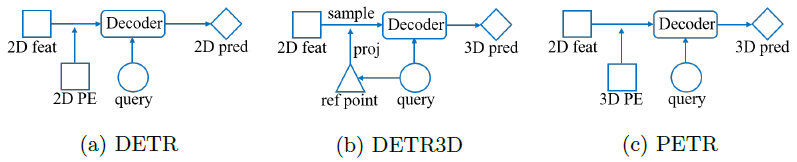
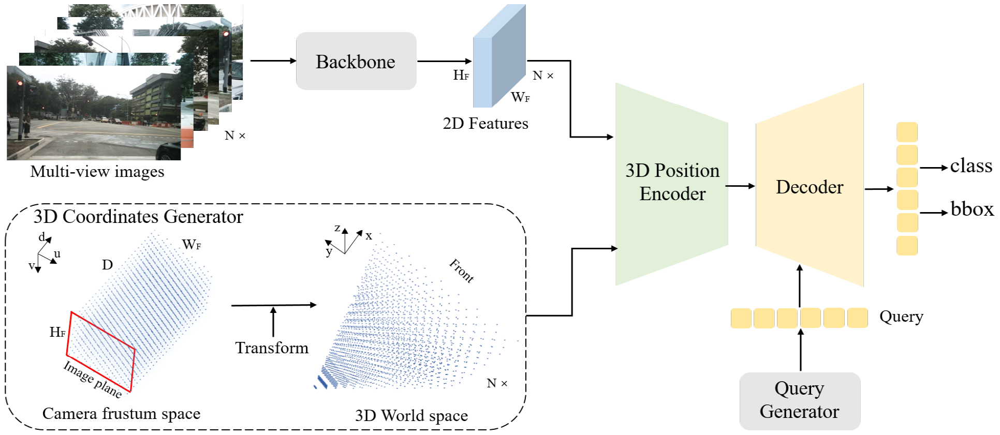
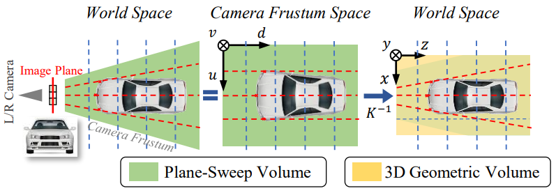
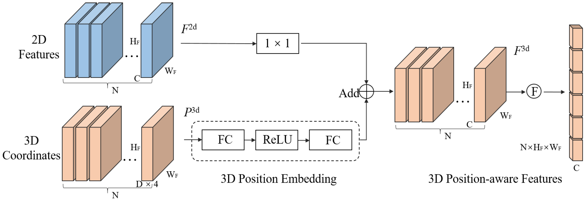

## 论文解读——PERT

DETR3D 的问题：

* 参考点投影机制：如果参考点出错，采样到的图像特征是无效的。
* 单点特征采样：参考点特征是 local ，不够 global。
* 采样方法比较复杂，petr 生成 3d 感知特征，简化投影过程。

> 上图可以看出，PETR 与 DETR 结构类似，不需要参考框，以及反向投影到 2D 图像的操作。其中的关键就是 3D PE，即 3D positional encode。下面介绍如何得到 3D PE。

### 整体流程

> 上图中，虚线框内的就是 3D PE。其中包含两个步骤：1. 3D 坐标生成; 2. 3D positional encoder。图像上的点 (u, v, d) 先转换到 3D 空间坐标，然后采用位置编码操作进 3D 位置编码。

### 详细过程

> 上图表示 3D 坐标生成过程。2D 到 3D 坐标转换可以通过相机参数算出来。

> 上图说明了 3D 位置编码生成过程：2D 图像上的每个像素都有 D 个深度，每个深度的位置都有一个 3D 坐标 xyz，即图中的 D x 4。4 表示 xyz1。多一个 1 是因为在矩阵计算时方便，没有实际含义。经过全连接层 FC 之后，与 2D 图像特征相加。

### 参考资料

* [b 站视频讲解——自动驾驶之心](https://www.bilibili.com/video/BV1ru4y1v7PY/?spm_id_from=333.337.search-card.all.click)
