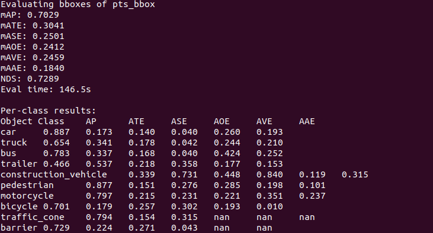

# 环境调试——CMT：Cross Modal Transformer

CMT 的官方源代码已经在 [github](https://github.com/junjie18/CMT) 上发布。其源码也是基于 mmdet3d 框架。根据官方 README，笔者也测试了其在 nuscenes 上的精度，与论文所述一致。本文记录笔者将官方源代码跑通过程。新手小白可能不太会 mmdet3d。笔者来个保姆级教程。建议完整看完本文，再动手实践，而不是边看边实践。

## 1.安装环境

* 新建 conda 环境

```bash
# conda env
conda create -n cmt python=3.8 -y
conda activate cmt
```

* pip 包安装

```bash
# pytorch 1.9.0+cu111
pip install torch==1.9.0+cu111 torchvision==0.10.0+cu111 torchaudio==0.9.0 -f https://download.pytorch.org/whl/torch_stable.html
# mmlab
pip install mmcv-full==1.6.0
pip install mmdet==2.24.0
pip install mmsegmentation==0.29.1
pip install mmdet3d==1.0.0rc5
# spconv
pip install spconv-cu111==2.1.21
# flash-attn
pip install flash-attn==0.2.2
# cv2
pip install opencv-python
# nuscenes
pip install nuscenes-devkit
# numpy
pip install numpy==1.22.4
```

> 将以上代码逐行敲入命令行，环境安装完成。mmcv-full 安装时间很长。
>
> 注意：在安装环境之前删除所有 pip 缓存包 `rm -rf ~/.cache/pip` 。

## 2.数据集准备

在 CMT 根目录下：

```bash
mkdir data && cd data
ln -s /path/to/your/nuscenes/dataset/root/ ./nuscenes
cd ..
```

> 上述代码将 nuscenes 数据集软连接到项目中。修改 `/path/to/your/nuscenes/dataset/root/` 为你自己的 nuscenes 数据集在磁盘中的路径。

## 3.数据预处理

修改原作者的 create_data.sh，编写数据预处理脚本，然后运行之。

```bash
# create_data.sh
CREATE_DATA='tools/create_data.py'
DATASET_NAME='nuscenes'
ROOT_PATH_PROJ=$(pwd)
ROOT_PATH="--root-path ${ROOT_PATH_PROJ}/data/nuscenes"
OUT_DIR="--out-dir ${ROOT_PATH_PROJ}/data/nuscenes"
EXTRA_TAG='--extra-tag nuscenes'
VERSION='--version v1.0'

python ${CREATE_DATA} ${DATASET_NAME} ${ROOT_PATH} ${OUT_DIR} ${EXTRA_TAG} ${VERSION}
```

上述代码会生成 pkl。当然你也可以省略这一步骤，直接下载 pkl，作者在其 github 也提供了这些 pkl 的下载地址。

> nuscenes 全集数据量巨大，数据预处理需要好几个小时。建议下班前跑起来，第二天早上处理完成。需要注意的是，数据预处理前，硬盘要腾出 100 个 G，不然磁盘容量不够，第二天一看白做。

## 4.下载 ckpt

* 新建文件夹：ckpts
* 根据[官方 README](https://github.com/junjie18/CMT)，下载 pth 权重，放到 ckpts 文件夹

## 5.测试数据

编写测试脚本，然后运行之。

```bash
# test.sh
TEST_PY='tools/test.py'
CONFIG_FILE='projects/configs/fusion/cmt_voxel0075_vov_1600x640_cbgs.py'
PTH='ckpt/voxel0075_vov_1600x640_epoch20.pth'
python ${TEST_PY} ${CONFIG_FILE} ${PTH} --eval bbox
```

> 不出意外可以看到测试效果，精度如原作者所述。



## 6.测试时 bug

1.SystemError: initialization of _internal failed without raising an exception

解决：重装 numba 库：

```bash
pip install -U numba  -i https://pypi.tuna.tsinghua.edu.cn/simple
```

2.ModuleNotFoundError: No module named 'projects'

解决：找不到 projects 包的原因是因为没有配置 python path。在 from projects.mmdet3d_plugin.datasets import CustomNuScenesDataset 之前插入代码：

```python
import sys
sys.path.append(os.path.dirname(os.path.dirname(os.path.dirname(__file__))))
print(sys.path)
```

## 7.训练时 bug

1.找不到文件路径

```
FileNotFoundError: [Errno 2] No such file or directory: 'nuscenes_gt_database/pts_dir/3d6241b0262d4ab98147a98c80656aa0_truck_20.bin'
```

解决：根据 [issue](https://github.com/junjie18/CMT/issues/21): 将 nuscenes_gt_database 软连接到项目根目录。

```
ln -s ./data/nuscenes/nuscenes_gt_database ./
```

2.OOM(CUDA OUT OF MERMORY)。参考 [issue](https://github.com/junjie18/CMT/issues/37)。

解决：作者给了两个配置文件，一个是使用 VOV 作为 backbone；另一个是使用 Resnet 作为 backbone。在 RTX 3090 上，使用 VOV 的配置文件会出现 OOM，但如果 batch_size 改为 1(原作者是2)的话，会有其它 bug。因此，使用 Resnet 作为 backbone 的配置文件。

```bash
TRAIN_PY='tools/train.py'
# CONFIG_FILE='projects/configs/fusion/cmt_voxel0075_vov_1600x640_cbgs.py'  # OOM on RTX 3090 with batch_size=2
CONFIG_FILE='projects/configs/fusion/cmt_voxel0100_r50_800x320_cbgs.py'
DEBUG_PY='-m debugpy --listen 8531 --wait-for-client'
GPU_NUM=8

# 多卡训练
bash tools/dist_train.sh ${CONFIG_FILE} ${GPU_NUM}
```

3.No kernel images ...

思路：[环境调试——UniAD](../../2023_10/env_uniad/env_uniad.md) 一文中也有这个问题。本地环境调试成功，但将 conda 环境上传之后会有这个问题。这里仍旧是 mmcv-full 的问题，需要将 mmcv-full 重新安装。

解决：环境重新上传。注意：下载 mmcv-full 的 whl 文件时候，不能直接从网上下载 whl，需要按照以下步骤：

* 进入本地已经安装好的 conda 环境
* 输入下载 whl 的命令：

  ```bash
  pip download mmcv-full==1.6.0 -f https://download.openmmlab.com/mmcv/dist/cu111/torch1.9.0/index.html --no-deps -d .
  ```
* 将下载好的 whl 文件上传
* 服务器卸载原有的 mmcv-full
* 服务器从 whl 安装 mmcv-full

## 日期

* 2024/03/13：训练时 bug
* 2023/09/18：文章撰写日期
