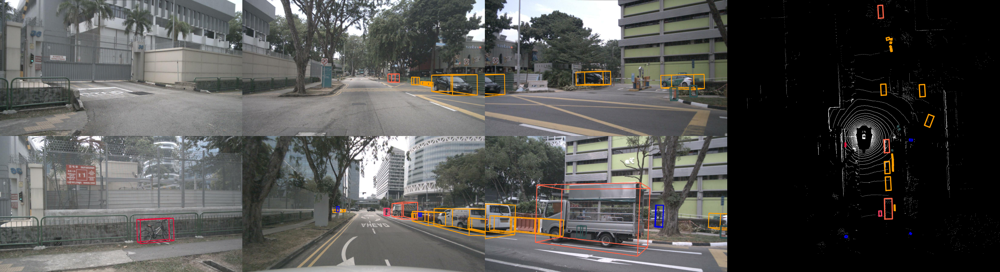

# nuscenes 数据集可视化

nuscenes 数据集中，每帧数据包含 6 个摄像头图片和 1 个激光雷达点云。本文介绍如何同时展示图像数据、点云数据、bbox 真值。

## 总体思路

大体分为以下几步：

1. bbox 和 label 转 numpy
2. bbox 画到 6 个图像上，保存
3. bbox 画到点云上，保存
4. 将点云图和 6 个图像拼接起来

其中，bbox 画到图像和点云上，需要用到以下脚本：

```python
# visualize.py
import copy
import os
from typing import List, Optional, Tuple

import cv2
import mmcv
import numpy as np
from matplotlib import pyplot as plt

from mmdet3d.core.bbox import LiDARInstance3DBoxes

__all__ = ["visualize_camera", "visualize_lidar", "visualize_map"]


OBJECT_PALETTE = {
    "car": (255, 158, 0),
    "truck": (255, 99, 71),
    "construction_vehicle": (233, 150, 70),
    "bus": (255, 69, 0),
    "trailer": (255, 140, 0),
    "barrier": (112, 128, 144),
    "motorcycle": (255, 61, 99),
    "bicycle": (220, 20, 60),
    "pedestrian": (0, 0, 230),
    "traffic_cone": (47, 79, 79),
    "tricycle": (220, 20, 60),  # 相比原版 mmdet3d 的 visualize 增加 tricycle
    "cyclist": (220, 20, 60)  # 相比原版 mmdet3d 的 visualize 增加 cyclist
}

MAP_PALETTE = {
    "drivable_area": (166, 206, 227),
    "road_segment": (31, 120, 180),
    "road_block": (178, 223, 138),
    "lane": (51, 160, 44),
    "ped_crossing": (251, 154, 153),
    "walkway": (227, 26, 28),
    "stop_line": (253, 191, 111),
    "carpark_area": (255, 127, 0),
    "road_divider": (202, 178, 214),
    "lane_divider": (106, 61, 154),
    "divider": (106, 61, 154),
}


def visualize_camera(
    fpath: str,
    image: np.ndarray,
    *,
    bboxes: Optional[LiDARInstance3DBoxes] = None,
    labels: Optional[np.ndarray] = None,
    transform: Optional[np.ndarray] = None,
    classes: Optional[List[str]] = None,
    color: Optional[Tuple[int, int, int]] = None,
    thickness: float = 4,
) -> None:
    canvas = image.copy()
    canvas = cv2.cvtColor(canvas, cv2.COLOR_RGB2BGR)

    if bboxes is not None and len(bboxes) > 0:
        corners = bboxes.corners
        num_bboxes = corners.shape[0]

        coords = np.concatenate(
            [corners.reshape(-1, 3), np.ones((num_bboxes * 8, 1))], axis=-1
        )
        transform = copy.deepcopy(transform).reshape(4, 4)
        coords = coords @ transform.T
        coords = coords.reshape(-1, 8, 4)

        indices = np.all(coords[..., 2] > 0, axis=1)
        coords = coords[indices]
        labels = labels[indices]

        indices = np.argsort(-np.min(coords[..., 2], axis=1))
        coords = coords[indices]
        labels = labels[indices]

        coords = coords.reshape(-1, 4)
        coords[:, 2] = np.clip(coords[:, 2], a_min=1e-5, a_max=1e5)
        coords[:, 0] /= coords[:, 2]
        coords[:, 1] /= coords[:, 2]

        coords = coords[..., :2].reshape(-1, 8, 2)
        for index in range(coords.shape[0]):
            name = classes[labels[index]]
            for start, end in [
                (0, 1),
                (0, 3),
                (0, 4),
                (1, 2),
                (1, 5),
                (3, 2),
                (3, 7),
                (4, 5),
                (4, 7),
                (2, 6),
                (5, 6),
                (6, 7),
            ]:
                cv2.line(
                    canvas,
                    coords[index, start].astype(np.int),
                    coords[index, end].astype(np.int),
                    color or OBJECT_PALETTE[name],
                    thickness,
                    cv2.LINE_AA,
                )
        canvas = canvas.astype(np.uint8)
    canvas = cv2.cvtColor(canvas, cv2.COLOR_BGR2RGB)

    mmcv.mkdir_or_exist(os.path.dirname(fpath))
    mmcv.imwrite(canvas, fpath)


def visualize_lidar(
    fpath: str,
    lidar: Optional[np.ndarray] = None,
    *,
    bboxes: Optional[LiDARInstance3DBoxes] = None,
    labels: Optional[np.ndarray] = None,
    classes: Optional[List[str]] = None,
    xlim: Tuple[float, float] = (-50, 50),
    ylim: Tuple[float, float] = (-50, 50),
    color: Optional[Tuple[int, int, int]] = None,
    radius: float = 15,
    thickness: float = 25,
) -> None:
    fig = plt.figure(figsize=(xlim[1] - xlim[0], ylim[1] - ylim[0]))

    ax = plt.gca()
    ax.set_xlim(*xlim)
    ax.set_ylim(*ylim)
    ax.set_aspect(1)
    ax.set_axis_off()

    if lidar is not None:
        plt.scatter(
            lidar[:, 0],
            lidar[:, 1],
            s=radius,
            c="white",
        )

    if bboxes is not None and len(bboxes) > 0:
        coords = bboxes.corners[:, [0, 3, 7, 4, 0], :2]
        for index in range(coords.shape[0]):
            name = classes[labels[index]]
            plt.plot(
                coords[index, :, 0],
                coords[index, :, 1],
                linewidth=thickness,
                color=np.array(color or OBJECT_PALETTE[name]) / 255,
            )

    mmcv.mkdir_or_exist(os.path.dirname(fpath))
    fig.savefig(
        fpath,
        dpi=10,
        facecolor="black",
        format="png",
        bbox_inches="tight",
        pad_inches=0,
    )
    plt.close()


def visualize_map(
    fpath: str,
    masks: np.ndarray,
    *,
    classes: List[str],
    background: Tuple[int, int, int] = (240, 240, 240),
) -> None:
    assert masks.dtype == np.bool, masks.dtype

    canvas = np.zeros((*masks.shape[-2:], 3), dtype=np.uint8)
    canvas[:] = background

    for k, name in enumerate(classes):
        if name in MAP_PALETTE:
            canvas[masks[k], :] = MAP_PALETTE[name]
    canvas = cv2.cvtColor(canvas, cv2.COLOR_RGB2BGR)

    mmcv.mkdir_or_exist(os.path.dirname(fpath))
    mmcv.imwrite(canvas, fpath)

```

> 以上脚本参考 bevfusion。

以上代码重点关注两个函数：`visualize_camera`，`visualize_lidar`。其中，`visualize_camera` 作用是将 bbox 投影到 6 个视角的图像上，并分别保存成图片，对应步骤  2；`visualize_lidar` 的作用是将 bbox 投影到点云上，并保存成 bev 视角的图片，对应步骤 3。

值得注意的是，`visualize_camera` 中，有一个参数 `transform`，这个参数是 lidar2image 的坐标转换矩阵。下面介绍如何得到这个矩阵。

## lidar2image

直接贴代码：

```python
def get_lidar2image(camera_info):
    lidar2camera_r = np.linalg.inv(camera_info["sensor2lidar_rotation"])
    lidar2camera_t = (
        camera_info["sensor2lidar_translation"] @ lidar2camera_r.T
    )
    lidar2camera_rt = np.eye(4).astype(np.float32)
    lidar2camera_rt[:3, :3] = lidar2camera_r.T
    lidar2camera_rt[3, :3] = -lidar2camera_t
    camera_intrinsics = np.eye(4).astype(np.float32)
    camera_intrinsics[:3, :3] = camera_info["cam_intrinsic"]
    lidar2image = camera_intrinsics @ lidar2camera_rt.T
  
    return lidar2image
```

## bbox 画到图像和点云上

```python
for 6 张图片:
    visualize_camera(
        img_save_path,
        image,
        bboxes=bboxes,
        labels=labels,
        transform=get_lidar2image(camera_info),
        classes=object_classes,
    )
visualize_lidar(
    lidar_save_path,
    points,
    bboxes=bboxes,
    labels=labels,
    xlim=[point_cloud_range[d] for d in [0, 3]],
    ylim=[point_cloud_range[d] for d in [1, 4]],
    classes=object_classes,
)
```

## 将点云图和 6 个图像拼接起来

拼接图片比较简单，使用 opencv 就能完成。主要步骤为：

1. 读图片：`cv2.imread(img_path)`
2. 横向拼接：`cv2.hconcat([img1, img2, img3])`
3. 纵向拼接：`cv2.vconcat([img1, img2])`
4. 保存拼接后的图片：`cv2.imwrite(path.png, img)`

```python
def combine_all(path_dict, combine_save_path):
    """将 6 个视角的图片和 bev视角下的 lidar 进行拼接

    :param img_path_dict: 每个视角的 img 图片路径 && bev 视角下 lidar 的图片路径

    |----------------------------------------------  | -------------
    |cam_front_left | cam_front  | cam_front_right   |
    |-------------- | ---------  | ---------------   |  lidar_bev
    |cam_back_left  | cam_back   | cam_back_right    |  
    |----------------------------------------------  | -------------
  
    """
    # 读 img
    cam_front = cv2.imread(path_dict["cam_front"])
    cam_front_left = cv2.imread(path_dict["cam_front_left"])
    cam_front_right = cv2.imread(path_dict["cam_front_right"])
    cam_back = cv2.imread(path_dict["cam_back"])
    cam_back_left = cv2.imread(path_dict["cam_back_left"])
    cam_back_right = cv2.imread(path_dict["cam_back_right"])
    # merge img
    front_combined = cv2.hconcat([cam_front_left, cam_front, cam_front_right])
    back_combined = cv2.hconcat([cam_back_right, cam_back, cam_back_left])
    back_combined = cv2.flip(back_combined, 1)  # 左右翻转
    img_combined = cv2.vconcat([front_combined, back_combined])
    # 读 lidar
    lidar_bev = cv2.imread(path_dict["lidar_bev"])
    # img_combined 等比例缩小
    target_height = lidar_bev.shape[0]
    scale_factor = target_height / img_combined.shape[0]
    target_width = int(img_combined.shape[1] * scale_factor)
    img_combined = cv2.resize(img_combined, (target_width, target_height))
    # merge all
    merge_image = cv2.hconcat([img_combined, lidar_bev])
    # 保存图片
    cv2.imwrite(combine_save_path, merge_image)
    return merge_image
```

## 效果图：



# 日期

2023/11/28：文章撰写
