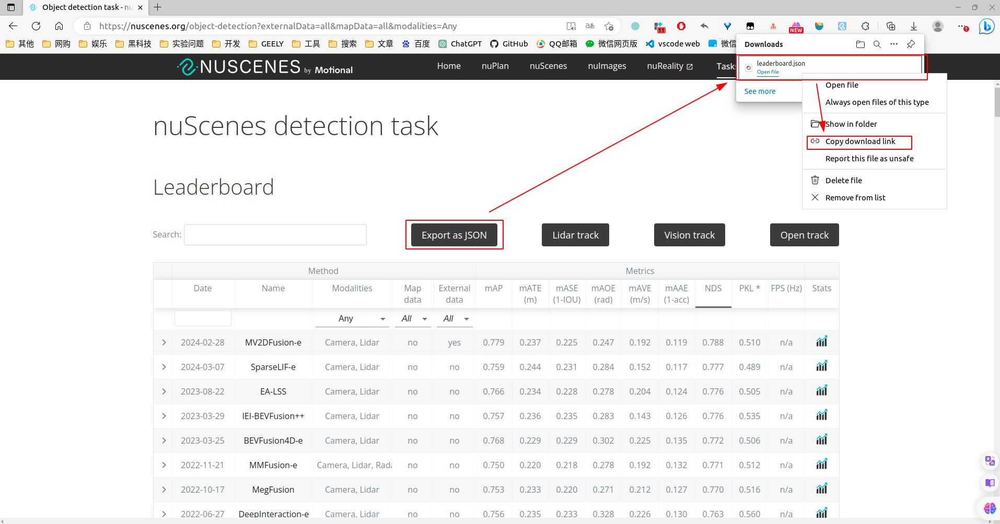
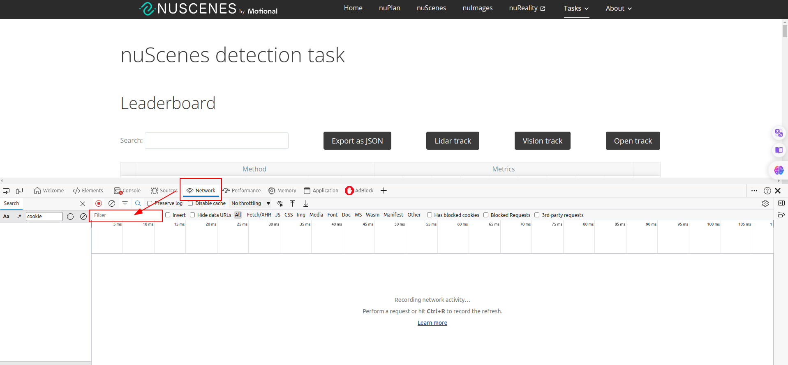
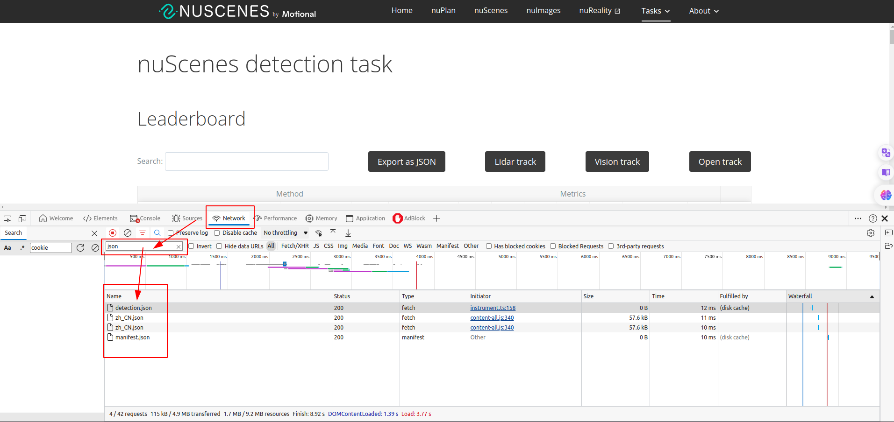
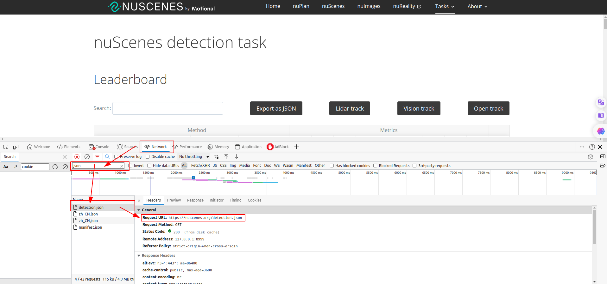

# 获取游览器具体下载地址

在[这个页面](https://nuscenes.org/object-detection?externalData=all&mapData=all&modalities=Any)有个下载按钮，点击可以下载 json 文件。如果想用代码下载，通常可以点击 `Copy download link` 获取下载链接。但是，这个网页中，点击 `Copy download link` 这个按钮不是真实的下载链接。参考了[这篇文章](https://blog.csdn.net/lkx444368875/article/details/90480392)后获得灵感。

## 方法

1.打开游览器进入这个页面。

2.按 F12 打开前端调试框，点击 Network。

3.在 Filter 框输入你要下载的文件后缀 "json"。

4.按 F5 刷新页面，此时你会看见好多 json 文件。

5.发现第一个 detection.json 是我们要的，点击它，就能看到真实 URL 链接了。

## 日期

2024/03/14：文章撰写日期
