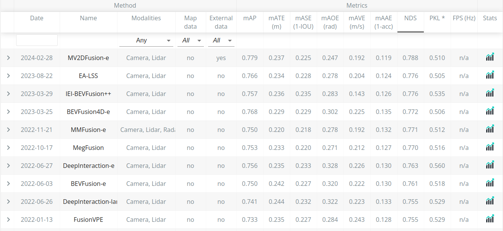

# BEV 感知——LSS 系列

BEV 感知分为"显式生成"和"隐式生成" BEV 两种方式。前者的代表是 LSS(Lift，Splat，Shoot)，后者的代表是 BEVFormer。

最近在看 nuscenes 榜单，发现前几名都是基于 Camera + Lidar 的 BEV 融合方案。其中 Camera 生成 BEV 的方式大多数是以 LSS 方法为主。

LSS 的核心问题：如何从 2D 环视图像生成 BEV？答：一共分成 2 步：Lift，Splat。其中，Lift 是将 2D 图像转换成 3D 伪点云，即，将图像上的 2D 像素点映射到 3D 空间中；Splat 是将 3D 伪点云拍扁成 BEV。熟悉 3D 点云目标检测的同学应该知道 Splat 操作可以使用诸如 PointPillar、VoxelNet 等方法。因此，算法的关键在于 Lift 操作。

之前虽然已经跑了很多诸如 BEVFusion 的模型，也看了很多关于 LSS 的文章讲解。但是 LSS 算法原理只是一知半解。

首先提几个问题：

* 如何生成伪点云？(将图像上的 2D 像素点映射到 3D 空间中)
* 代码中的视锥(frustum) 到底是什么，有什么作用？
* 如何将 3D 伪点云拍扁成 BEV？

下面一点点来看。

## 1.如何生成伪点云

将 2D 图像转换成 3D 伪点云有两种方式：深度估计或高度估计。现在大多数工作都用的是深度估计，为什么要深度估计？

下面我引用知乎某大佬的文章——[BEV 感知综述](https://zhuanlan.zhihu.com/p/654311603?utm_id=0)。看了很多文章，他讲得最好。

> 视觉BEV感知的核心在于将透视视图下的图像信息变换到BEV视图。这是一个理论上的病态问题，因为一个图像像素会对应3D空间中的多个位置。这种一对多的歧义性是因为我们不知道像素在3D空间中对应的高度或者深度。这二者知其一（下图中的Oy或者Oz），我们就可以通过相机的内外参矩阵将图像的每一个像素都变换到3D空间。

> 因此， 图像到BEV的视图转换也大致有两种思路：一种假设高度（Oy）已知，一种假设深度（Oz）已知 。
> 前者的典型思路是假设目标位于路面，因此高度为0，这样就可以采用Homography变换将图像转换到BEV视图，比如BEV-IPM。在实际应用中，路面并非绝对平坦，而且除了车道线以外，其他的目标都有一定的高度。在这些情况下，高度已知的假设并不成立，变换后的图像误差也很大。因此，反变换的方法在BEV感知中采用的相对较少。
> 后者通常会依赖于主动传感器直接获得深度信息（比如激光雷达）或者从图像中通过显式或者隐式的方式获得深度信息。激光雷达或者毫米波雷达与视觉融合后，会提高深度估计的准确度。

上面的引用回答了为什么需要深度估计：若已知图像坐标系下的某个带深度的点 P(xi, yi, d)，可以利用相机内外参，将其转换到在 3D 坐标系下的坐标 P'(x, y, z)，P'(x, y, z) 就是伪点云。P(xi, yi, d)，(xi, yi) 代表图像坐标，d 代表这个点到相机平面的距离，即上图中的 Oz。

## 2.视锥(frustum)

LSS 首先进行特征提取(下采样)，得到特征图 F。在特征图 F 上，并非对于每个像素点估计一个深度值，而是估计 D 个深度值的概率分布，也就是每个像素点对应 D 个深度。(提问：为什么不是估计一个深度值？)

未完待续。。。

## 参考资料

* [bev 感知综述——知乎](https://zhuanlan.zhihu.com/p/654311603?utm_id=0)
* [BEVPool 是什么——b 站](https://www.bilibili.com/video/BV1Xc411y72c/?spm_id_from=333.788&vd_source=da7944bcc998e29818ec76ea9c6f1f47)

## 日期

2024/03/07：文章撰写日期
