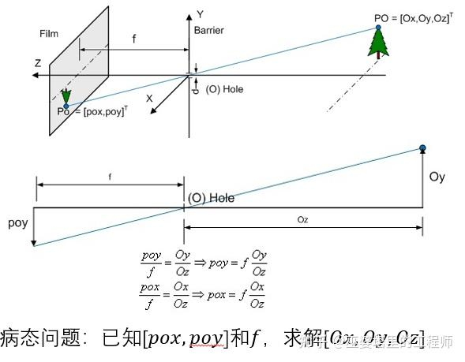

# 论文解读——LSS(Lift，Splat，Shoot)

BEV 感知分为"显式生成"和"隐式生成" BEV 两种方式。前者的代表是 LSS(Lift，Splat，Shoot)，后者的代表是 BEVFormer。

最近在看 nuscenes 榜单，发现前几名都是基于 Camera + Lidar 的 BEV 融合方案。其中 Camera 生成 BEV 的方式大多数是以 LSS 方法为主。

LSS 的核心问题：如何从 2D 环视图像生成 BEV？答：一共分成 2 步：Lift，Splat。其中，Lift 是将 2D 图像转换成 3D 伪点云，即，将图像上的 2D 像素点映射到 3D 空间中；Splat 是将 3D 伪点云拍扁成 BEV。熟悉 3D 点云目标检测的同学应该知道 Splat 操作可以使用诸如 PointPillar、VoxelNet 等方法。因此，算法的关键在于 Lift 操作。

之前虽然已经跑了很多诸如 BEVFusion 的模型，也看了很多关于 LSS 的文章讲解。但是 LSS 算法原理只是一知半解。


首先提几个问题：

* 如何生成伪点云？(将图像上的 2D 像素点提升到 3D 空间中)
* 代码中的视锥(frustum) 到底是什么，有什么作用？
* 如何将 3D 伪点云拍扁成 BEV？

下面一点点来看。

## 1.2D -> 3D

将 2D 图像转换成 3D 伪点云有两种方式：深度估计或高度估计。现在大多数工作都用的是深度估计，为什么要深度估计？

下面我引用知乎某大佬的文章——[BEV 感知综述](https://zhuanlan.zhihu.com/p/654311603?utm_id=0)。看了很多文章，他讲得最好。

> 视觉BEV感知的核心在于将透视视图下的图像信息变换到BEV视图。这是一个理论上的病态问题，因为一个图像像素会对应3D空间中的多个位置。这种一对多的歧义性是因为我们不知道像素在3D空间中对应的高度或者深度。这二者知其一（下图中的Oy或者Oz），我们就可以通过相机的内外参矩阵将图像的每一个像素都变换到3D空间。



> 因此， 图像到BEV的视图转换也大致有两种思路：一种假设高度（Oy）已知，一种假设深度（Oz）已知 。
> 前者的典型思路是假设目标位于路面，因此高度为0，这样就可以采用Homography变换将图像转换到BEV视图，比如BEV-IPM。在实际应用中，路面并非绝对平坦，而且除了车道线以外，其他的目标都有一定的高度。在这些情况下，高度已知的假设并不成立，变换后的图像误差也很大。因此，反变换的方法在BEV感知中采用的相对较少。
> 后者通常会依赖于主动传感器直接获得深度信息（比如激光雷达）或者从图像中通过显式或者隐式的方式获得深度信息。激光雷达或者毫米波雷达与视觉融合后，会提高深度估计的准确度。

上面的引用回答了为什么需要深度估计：若已知某个深度图上的的点 P(d, u, v)，可以利用相机内外参，将其转换到在 3D 坐标系下的坐标 P'(x, y, z)，P'(x, y, z) 就是伪点云。P(d, u, v)，(u, v) 代表图像坐标，d 代表这个点到相机平面的距离，即上图中的 Oz。

## 2.视锥(frustum)

网上有很多讲解视锥的文章，大多都是直接讲解 LSS 代码中视锥生成过程。我先来讲讲是锥是什么。[了解视锥体](https://docs.unity3d.com/cn/2021.1/Manual/UnderstandingFrustum.html)一文中提到，视锥是一个看起来像金字塔的形状。视锥体内部是相机所能拍摄到的画面范围。如下图。


## 3.生成伪点云

以 LSS 为例，在这个视锥内部，从距离相机平面 4m 的平面开始，每隔 1m 画一个平面，一直到 45m 的范围，一共有 41 个平面，即 41 个深度。我们在每个平面上取相同个数的点，作为伪点云，如上图 A1-A41, B1-B41。那么每个平面上取多少个点，怎么取呢？

### 3.1.取多少个点

LSS 首先进行特征提取(下采样)，得到特征图 F(u, v)。在特征图 F 的深度方向上，取 d 个深度值，如上图，d 就等于 41，即 41 个平面。那么，要取的点的个数就是 d*u*v。

### 3.2.如何取点

这里直接上代码。(代码来自 BEVFusion，与 LSS 几乎一样)

```python
import torch
import torch.nn as nn
import cfg


class Lss():
    def __init__(self):
        self.frustum = self.create_frustum().to('cuda')
        # (B, N, D, H, W, 3) = torch.Size([2, 6, 118, 32, 88, 3])
        self.geom = self.get_geometry(cfg.camera2lidar_rots,
                                      cfg.camera2lidar_trans,
                                      cfg.intrins,
                                      cfg.post_rots,
                                      cfg.post_trans)
        print(self.geom)

    def create_frustum(self):
        # 原图大小
        iH, iW = 128, 352
        # 特征图大小
        fH, fW = 8, 22
        # 原图的深度范围：4-45，每隔 1 米有个深度值
        dbound = [4, 45, 1]

        ds = (
            torch.arange(*dbound, dtype=torch.float)
            .view(-1, 1, 1)
            .expand(-1, fH, fW)
        )
        D, _, _ = ds.shape

        xs = (
            torch.linspace(0, iW - 1, fW, dtype=torch.float)
            .view(1, 1, fW)
            .expand(D, fH, fW)
        )
        ys = (
            torch.linspace(0, iH - 1, fH, dtype=torch.float)
            .view(1, fH, 1)
            .expand(D, fH, fW)
        )
        # 特征图的深度点到原图的映射。
        # (d, h, w, 3)=torch.Size([41, 8, 22, 3])
        frustum = torch.stack((xs, ys, ds), -1)
        return nn.Parameter(frustum, requires_grad=False)

    def get_geometry(
        self,
        camera2lidar_rots,
        camera2lidar_trans,
        intrins,
        post_rots,
        post_trans,
    ):
        B, N, _ = camera2lidar_trans.shape

        # 去掉图像增强
        # B x N x D x H x W x 3
        points = self.frustum - post_trans.view(B, N, 1, 1, 1, 3)
        points = (
            torch.inverse(post_rots)
            .view(B, N, 1, 1, 1, 3, 3)
            .matmul(points.unsqueeze(-1))
        )
        # 将点转换到lidar坐标系
        points = torch.cat(
            (
                points[:, :, :, :, :, :2] * points[:, :, :, :, :, 2:3],
                points[:, :, :, :, :, 2:3],
            ),
            5,
        )
        combine = camera2lidar_rots.matmul(torch.inverse(intrins))
        points = combine.view(B, N, 1, 1, 1, 3, 3).matmul(points).squeeze(-1)
        points += camera2lidar_trans.view(B, N, 1, 1, 1, 3)

        # (B, N, D, H, W, 3) = torch.Size([1, 6, 118, 32, 88, 3])
        return points


def main():
    lss = Lss()


if __name__ == '__main__':
    main()

```

上述代码中，包含两个函数：`create_frustum`、`get_geometry`。

`create_frustum` 函数：其实生成的是特征图 F(d, h, w) 到原图 I(u, v, d') 的映射关系。frustum 的形状是 (d, h, w, 3)，代表在特征图上位置为(h, w)，深度为 d 的点，在原图上的坐标 (u, v, d')。

`get_geometry` 函数：1.还原数据增强：由于图像进来之前作了数据增强，因此先要还原数据增强。2.从图像坐标系转换到需要的坐标系(ego 或 Lidar 坐标系，上述代码中是 Lidar 坐标系)。

这样，就得到了 d\*h\*w 个点在 Lidar 坐标系下的 xyz 坐标。

有人会问，每个点的深度只有一个值，怎么能在每个平面上都取点呢？

这个问题 LSS 论文以及网上一些博客已经说得很详细了：对于每个像素点并非估计一个深度值，而是估计 D 个深度值的概率分布，也就是每个像素点对应 D 个深度。(提问：为什么不是估计一个深度值？)

## 4.拍扁到 BEV

这个操作在 LSS 中叫做 Voxel Pooling，在 BEVDet 以及 BEVFusion 中叫做 BEVPool。先大致说下原理：首先，预设 BEV 空间为 H\*W\*L 个 Voxel。然后对于每个 Voxel，找之前 2D -> 3D 时 lift 的 d\*h\*w 个点中，属于这个 voxel 的点的特征向量全部加起来，作为这个 voxel 的特征向量。因为 voxel 是规则的，所以 voxel 到 bev 就很容易，方法和点云一样。

LSS 的 Voxel Pooling 是用 python 写的，单线程，速度很慢、显存占用很高。BEVPool 将 Voxel Pooling 改写成 cuda 算子，对每个 voxel 的计算采用多线程。但还是太耗时、太耗显存，于是 BEVDet 的作者搞了个 BEVPoolv2，大大加速了此过程。


### 4.1.BEVPool 原理

如上图左半部分。Feature 表示特征图，其形状为 NHWC，N 代表环视相机个数，Nuscenes 中为 6。Depth Score 表示预测的深度分布，NDHW 表示每个相机图像中，在 HW 位置包含 D 个深度值，这 D 个深度值是概率分布。

Depth Score 和 Feature 相乘得到视锥体 Frustum Feature，大小为 NDHWC。Voxel Index 由相机内外参计算得到，形状为 NDHW，表示在 NDHW 位置的点属于 BEV 空间下哪个 Voxel。他俩可以得到一张 Voxel Index 到 Frustum Feature 的映射表。表的长度为图像特征点云的个数(这个值 <= NDHW，因为要过滤掉超出 voxel 空间的点)。将这个表按照 voxel index 排序排好，然后使用 cuda 多线程处理每个 voxel 特征。

### 4.2.BEVPoolv2 原理

BEVDet 的作者分析了 BEVPool 耗时和耗显存在与计算和存储大小为 NDHWC 的 Frustum Feature。因此提出 BEVPoolv2。

如上图右半部分。BEVPoolv2 首先建立 Voxel Index 到 Frustum Index 的映射表(对比 BEVPool 是 Frustum Feature)。然后处理的时候根据 Frustum Index 到 Depth Score 和 Feature 去取相应的值。这样就不用计算和存储Frustum Feature，速度就快很多了。

个人认为，上图中 BEVPoolv2 的映射表 Frustum Index 用字母表示不太好，用数字表示更好，可能作者是想区别于 Voxel Index 吧。

## 参考资料

* [bev 感知综述——知乎](https://zhuanlan.zhihu.com/p/654311603?utm_id=0)
* [BEVPool 是什么——b 站](https://www.bilibili.com/video/BV1Xc411y72c/?spm_id_from=333.788&vd_source=da7944bcc998e29818ec76ea9c6f1f47)

## 日期

* 2024/05/09：BEVPoolv2
* 2024/03/07：文章撰写日期
