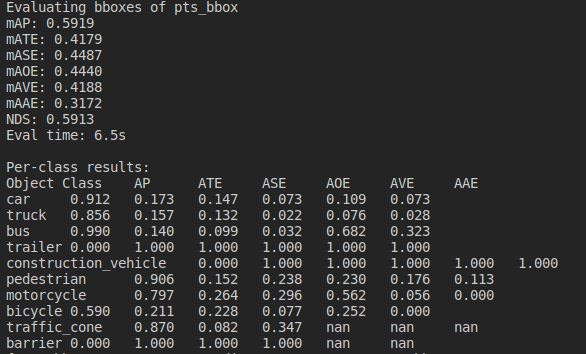
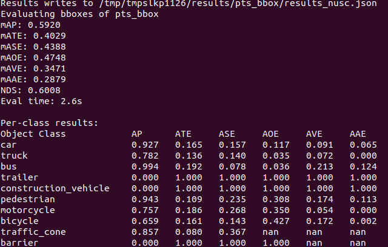
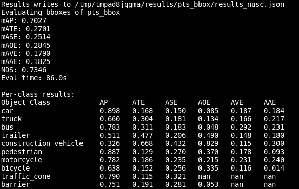
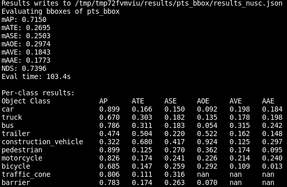

# 记录各种模型测试结果

本文记录不同算法在公开数据集的测试结果。

## CMT

配置参数：

* 数据集：nuscnes-mini
* config：cmt_voxel0075_vov_1600x640_cbgs.py
* pth 来源：官方
* 测试 gpu：xxx

结果：NDS=0.5913

配置参数：

* 数据集：nuscnes-big
* config：cmt_voxel0075_vov_1600x640_cbgs.py
* pth 来源：官方
* 测试 gpu：1*3090

结果：NDS=0.7289

## DAL

配置参数：

* 数据集：nuscnes-mini
* model：dak-base.py
* pth 来源：官方
* 测试 gpu：1*3090

结果：NDS=0.6008

配置参数：

* 数据集：nuscnes-big
* model：dal-base.py
* pth 来源：官方
* 测试 gpu：8*A100

结果：NDS=0.7346

配置参数：

* 数据集：nuscnes-big
* model：dal-large.py
* pth 来源：官方
* 测试 gpu：8*A100

结果：NDS=0.7396

## 日期

* 2024/04/10：dal-base、dal-large 测试结果
