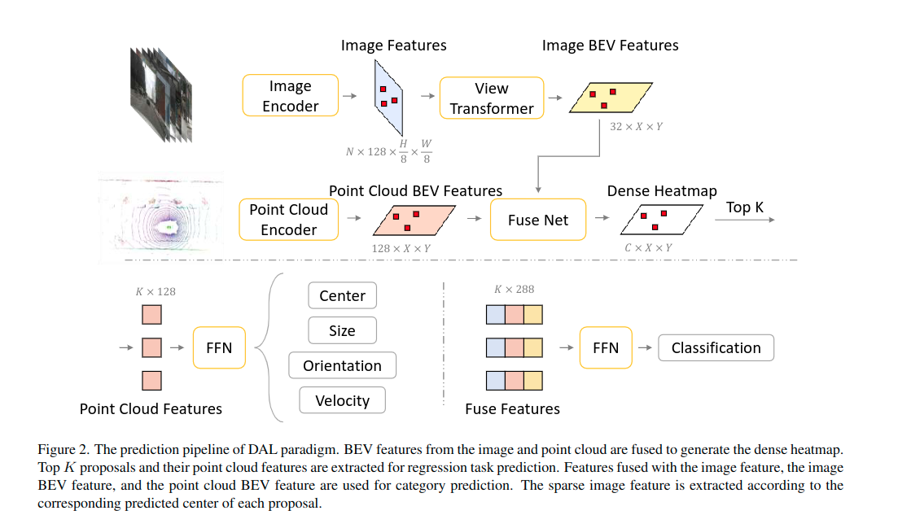
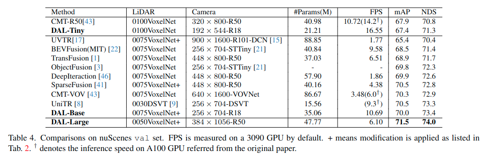
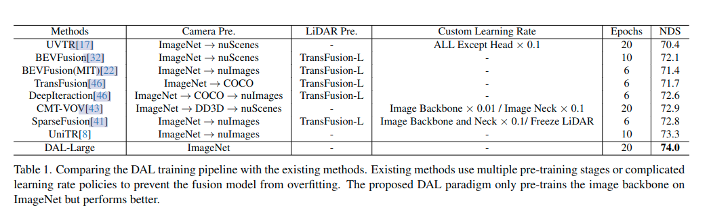
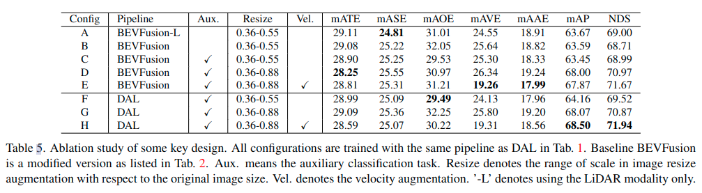

# 论文解读——DAL

在查看 Nuscnes 3D 检测榜单时，前几名都是加入了 TTA ，即 Test-Time-Aug 的。DAL 是没加 TTA 的模型中，效果最好的那个。因此值得仔细研究。

DAL 全称：`Detecting As Labeling: Rethinking LiDAR-camera Fusion in 3D Object Detection`，作者是鉴智的 Junjie Huang，其代表作还有著名的 BEVDet。

## 论文创新点

从论文标题可以得知，此模型的思路源自对数据标注的过程：在数据标注的时候，会来回对比每一帧的图像和激光点云数据。确定在某个位置有障碍物之后，只在点云上进行 3D box 的标注。而类别更多地从图像进行确定。

作者分析了 BEVFusion 中，图像和点云两种模态的 BEV 拼接的问题：在检测的过程中，图像特征会干扰激光点云特征，导致网络过拟合。因此因当只使用激光点云模态来进行回归任务。在分类任务中，可以加入图像特征。

另外，Nuscene 数据集，不同帧、不同 object 的速度分布不均衡。参考论文中的表 3。因此作者在数据预处理中提出了实例级速度增强。（暂时没看懂）

## 整体流程

直接上图：

整体流程还是很好理解的。对于新手小白建议先补充以下两篇论文知识：

* Centeroint：上图中，虚线左下部分表示回归 box 任务，来自 Centepoint。为什么Center、Size、Orientation、Velocity 这几个量可以用来表示 box，参考 Centeroint。
* Transfusion：讲解了为什么使用 Heat map，以及有什么优势。点击文参考资料。
* BEVFusion-MIT：讲解了如何将图像、点云两种模态进行拼接。ps：BEVFuison 也使用了 Transfusion Head。

上图中，虚线上半部分就是 BEVFusion。两种模态的 BEV特征，融合之后，得到 Heatmap。从 Heatmap 中获取最敏感的 k 个点，将其分别投影到 Lidar BEV、Image BEV、image Feature 上，获取对应的特征向量。

虚线下半部分说明了回归任务只使用 Lidar BEV feature，分类任务使用 Image feature、 Lidar BEV feature、Image BEV feature。

## 实验结论

论文给出了 DAL 与其他优秀模型的精度对比。

笔者使用官方给的模型权重跑了一下，精度吻合。参考前文[记录各种模型测试结果](../eval_models/eval_models.md)。

### 实验细节

图像辅助分类头

作者在 Transfusion Loss 的基础上还增加了图像辅助分类头 aux，以加强图像分支。作者说这部分挺重要。笔者看了一下论文，浅谈一下自己粗浅的理解：Image Feature 经过 LSS 那一套变成 Image BEV，然后和 Lidar BEV concat 之后，获取 Top K 个关键点。但是深度估计不准，导致这 Top K 个位置不准，进而导致反投影到 Image feature map 上获取的 Image feature 不准，即有些 Image 上的 object 的 feature 无法代表这个物体。因此，在反向传播的过程中，Image feature map 可能训练得不好。作者通过增加图像辅助分类头来解决这个问题：使用真值 box 的重心来监督图像 Image feature map 的训练。

插个眼：这部分具体代码还没仔细看，看了在回来更新。

### 实验结果

作者对比了 DAL 与其他论文的训练流程。我们在模型训练的过程中都需要加载预训练权重。许多其他论文所加载的 backbone 预训练权重，都是在很多不同的数据集上进行过训练，而 DAL 只使用在 ImageNet 上训练过的 ResNet。

插个眼：笔者在复现许多论文的时候，发现按照原作者的配置训练，也到不到原作者的精度。是否与原作者所使用的预训练权重有关？

### 消融实验

DAL 和 BEVFuison 相差：

在回归任务中，BEVFusion 使用了多模态融合的 BEV feature map，DAL 只使用 DAL。

DAL 还加入了图像辅助分类头。

* A 表示 BEVFusion 只使用 Lidar。
* B 表示 BEVFusion 的 Image backbone 只使用 ImageNet 训练。

对比 A-B：意味着 BEVFusion 依赖于复杂的预训练策略来利用图像模态。直接 load 从 ImageNet 分类任务中预训练的权重，对于 BEVFusion 是不可行的。

* F 表示 DAL 的训练方式。在 BEVFusion-L 的基础上，增加了图像模态辅助分类任务。

对比 A-F：意味着加入图像辅助分类头并使用图像特征来作分类任务对检测指标有提升。

* G 表示在 F 的基础上调整图像 Resize 的范围。

对比 F-G：意味着放大图像调整范围，可以大幅提升检测指标。

* H 表示在 G 的基础上增加了速度增强。

对比 G-H：意味着使用速度增强也会提升指标。训练集中的更平衡的速度分布显着降低了 25% 的预测误差。

对比 B-C：BEVFusion 如果也使用图像辅助分类头，对结果影响不大。也就是说，如果 Image BEV feature map 也参与到回归任务中，那么图像辅助分类头用处不大。作者推测：在密集BEV编码器之前融合特征太早，无法从图像中线索保持相对独立的判断。(没懂作者的推测，插个眼)

对比 D-G：BEVFusion 和 DAL 指标区别不大。意味着在回归任务中，放大图像的调整范围，会破坏图像和回归任务预测之间的联系，迫使模型专注于点云。

对比 E-H：同样增加速度增强之后，放大图像的调整范围，DAL 会比 BEVFusion 略微提升。作者说速度增强挑战了点云线索的回归任务预测，这迫使模型利用图像线索。(没懂，插个眼)

## 参考资料

* [TransFusion学习笔记1](https://blog.csdn.net/ChuiGeDaQiQiu/article/details/133493065)
* [TransFusion学习笔记2](https://blog.csdn.net/ChuiGeDaQiQiu/article/details/133544746)

## 日期

* 2024/04/12：文章撰写日期
