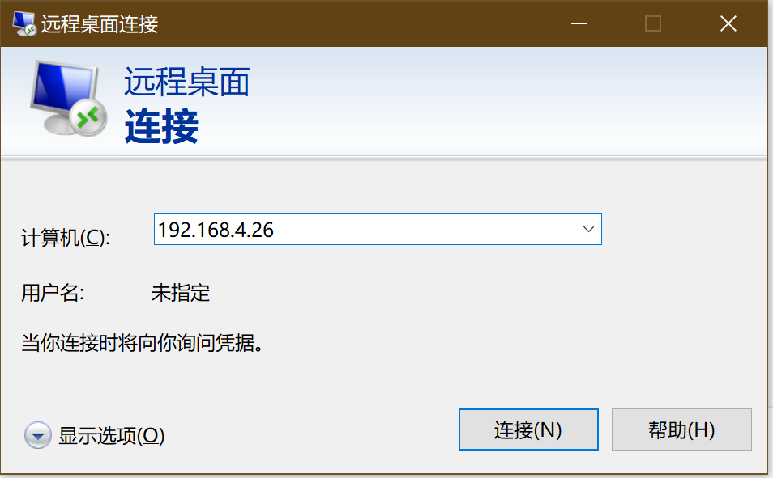
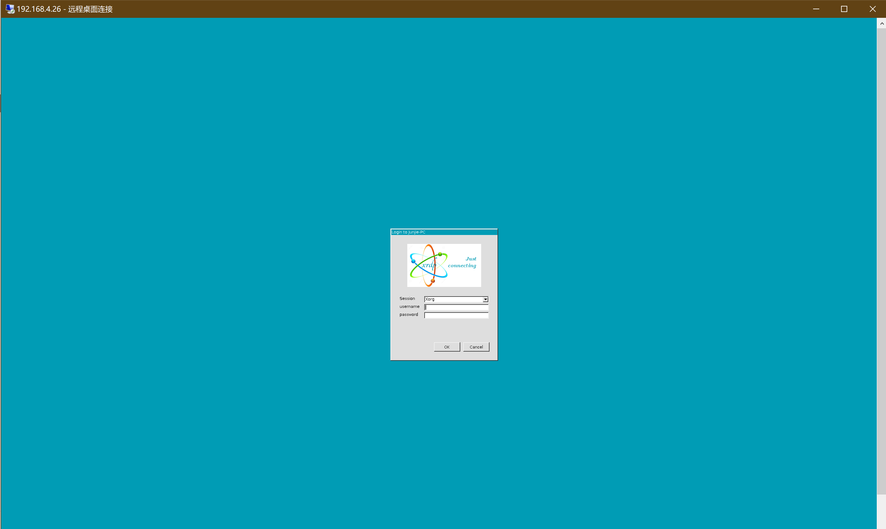
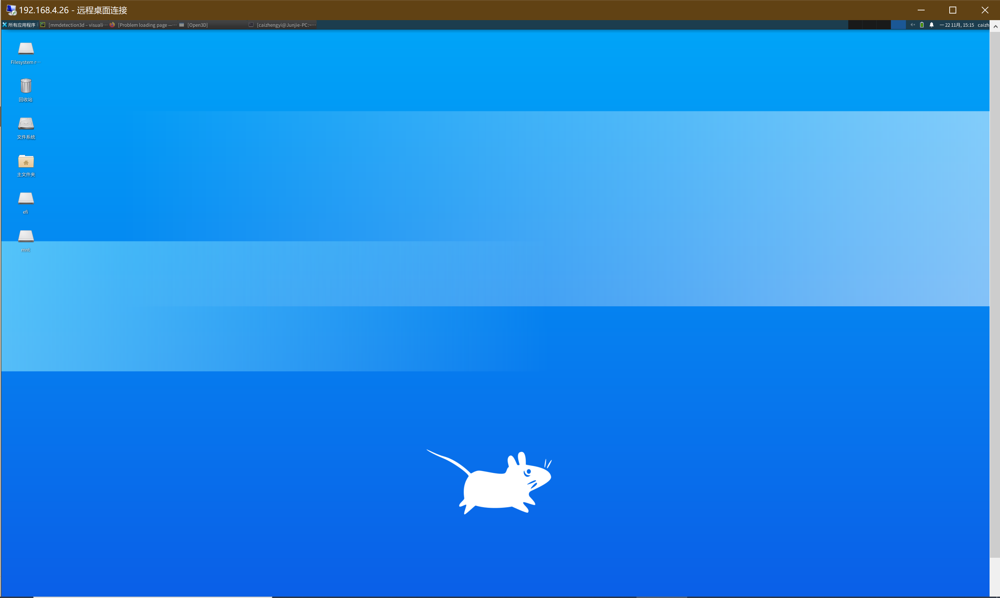

# 基于Ubuntu20.04的远程桌面安装


## 前言

在做视觉任务的时候常常需要可视化操作，但是多人共同使用一台机器的时候，要跑到别人位置上进行操作，就很不方便了。因此需要远程桌面。

## 安装步骤

```bash
# 安装xrdp等软件
sudo apt install xfce4 xfce4-goodies xorg dbus-x11 x11-xserver-utils -y
sudo apt install xrdp xorgxrdp -y
# 启动xrdp
sudo systemctl enable xrdp
sudo systemctl start xrdp
sudo systemctl status xrdp
# 配置xrdp
sudo chmod 666 /etc/xrdp/xrdp.ini
sudo echo "exec startxfce4" >> /etc/xrdp/xrdp.ini
echo xfce4-session > ~/.xsession
sudo systemctl restart xrdp
# 配置防火墙
sudo ufw allow 3389
```

笔者已经将上述代码写成脚本，可以直接使用我的仓库

```bash
bash -c "$(curl -fsSL https://github.com/daxiongpro/Qdotfiles/blob/master/scripts/init_a_fresh_ubuntu/5.install_desktop.sh)"
```

## 使用方法

#### 1.在本地windows电脑打开“远程桌面”软件

#### 2.在远程桌面输入服务器地址，端口就默认的3389，如图



#### 3.点击“连接”之后，出现



#### 4.输入用户名和密码，就进入桌面，可以进行一系列可视化操作了



## 后记

笔者开始是在Ubuntu18.04上安装，经过不断搜索后安装成功了。但是重装系统后怎么都装不成功（装成功了，但是无法运行），因此升级成20.04进行安装

ubuntu18.04可通过命令行直接升级为20.04，代码如下：

```bash
sudo do-release-upgrade
```


## 参考文献

[安装教程](https://zhuanlan.zhihu.com/p/149501381)

[远程桌面输入用户名密码之后，只显示蓝色背景问题](https://github.com/quaggalinux/ubuntu18.04_desktop_fix_xorg_not_compatible)

[远程桌面卡顿问题](https://blog.lopygo.com/2020/2020-04-27-remote-desktop-without-display/)