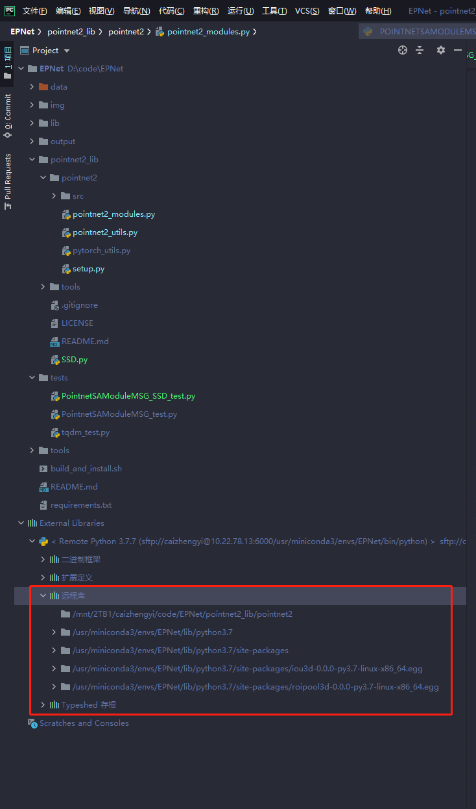
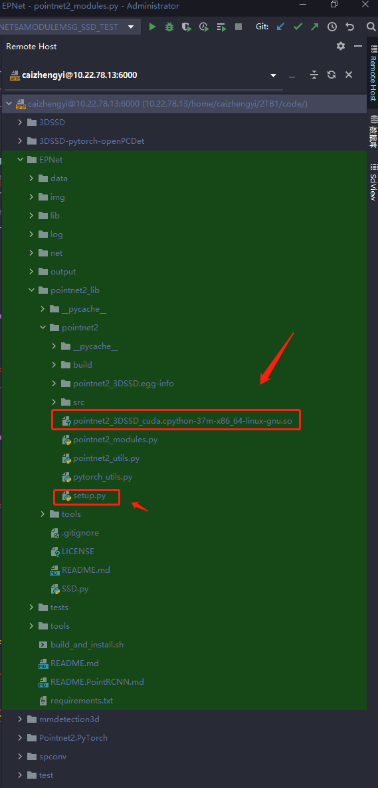
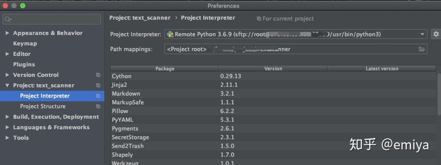
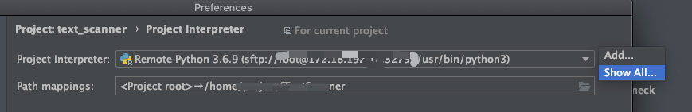
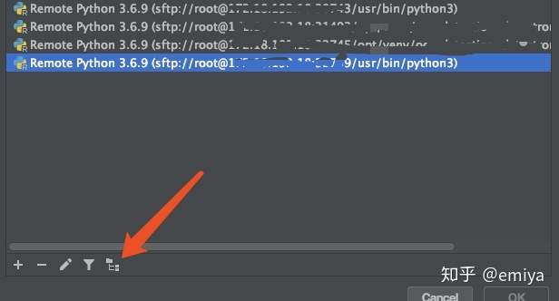
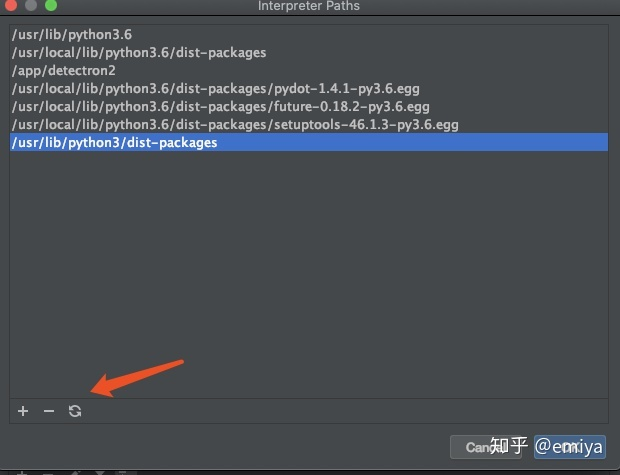

### 编写函数三个引号调不出参数模板

- 去File | Settings | Tools | Python Integrated Tools | Docstring format 
- 这里改成你想要的格式，然后再回去看看你的三个引号。默认的可能是plain也就是空的

### 解决git无法clone提示443以及配置git代理方法
原因：pycharm设置了代理，但git没有设置代理

解决办法：
- 打开cmder
- git config --global http.proxy "localhost:1080"

### linux机器上有包，pycharm远程连接，包却找不到

##### 问题描述：编译了一个包，名叫"pointnet2_3DSSD_cuda"。用Mobaxterm连接远程服务器，进入相应的虚拟环境，可以导入。但是用pycharm远程连接，运行时却报错，找不到相应的模块。

##### 原因分析：

##### pycharm远程库

pycharm远程部署后，会把远程的library拷贝一份到本地，于是在本地能看到，如图所示：



##### python setup.py develop和install的区别：

（猜想）develop不会将包安装进anaconda的库，直接放在源代码的文件夹里，install会放到anaconda的库里。develop的如图：



解决方法

- ##### 寻找包的路径

  ```python
  import torch  # 导入pointnet2_3DSSD_cuda之前，必须先导入torch这个库，即：import torch
  import pointnet2_3DSSD_cuda
  pointnet2_3DSSD_cuda.__file__  # 要寻找当前环境的pointnet2_3DSSD_cuda这个包放在机器的哪个路径
  >>> '/mnt/2TB1/caizhengyi/code/EPNet/pointnet2_lib/pointnet2/pointnet2_3DSSD_cuda.cpython-37m-x86_64-linux-gnu.so'
  ```


- ##### 将路径添加到远程库










##### 参考文献：https://blog.csdn.net/weixin_35922953/article/details/112496023?utm_medium=distribute.pc_relevant.none-task-blog-baidujs_title-1&spm=1001.2101.3001.4242